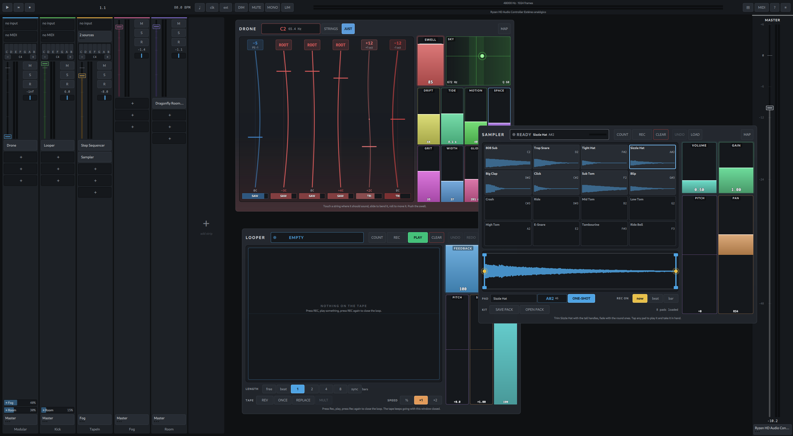

# Nirbija

A Linux mixer that is also an instrument. A drone synth, a sixteen-pad sampler,
a looper, a step sequencer and an arpeggiator live inside it and need nothing
installed — and LV2, CLAP and VST3 go in the same slot, over JACK or PipeWire,
with the plugins' own editors embedded in the window.



<https://zednaked.github.io/nirbija-site/>

## What it is

A rack of channel strips, in the spirit of AUM on iOS, which Linux does not
have. Each strip is a chain: an instrument, then effects, then a fader with
sends. MIDI made by one plugin joins what the next one in the chain receives,
so a step sequencer above a synth plays it.

The difference from the other hosts is that a session does not start empty. The
instruments below ship with the binary.

## Built in

| | |
|---|---|
| **Drone** | six strings that never stop, just intonation, per-string cents, swell, drift |
| **Sampler** | sixteen pads; record from the strip or load a file; the sequencer reads the names |
| **Looper** | quantised launch, reverse, half/double, multiply, replace, once |
| **Step Sequencer** | sixteen steps, swing, scales, reverse/pendulum, chance, ties |
| **Arpeggiator** | up, down, up-down, as played, random, chord; octaves and latch |
| **Chord** | split keyboard; below the split, one key fires a whole chord |
| **FX Pad** | sixteen graduated effects; pitch, filter, comb and ring go both ways |
| **Script** | a MIDI plugin you write in Lua, in the mixer |
| **File Player** | a file into a strip |
| **Computer Keyboard** | GarageBand-style typing keyboard; no MIDI hardware needed |

They sit in the picker with everything else you have installed.

The **Drone** also builds as a standalone CLAP (`build/clap/Nirbija Drone.clap`)
for other hosts. Copy it into `~/.clap`; it is not part of the install.

## Also in the box

**Bluetooth LE MIDI.** PipeWire advertises a BLE keyboard as a JACK port and
then never delivers its events; Nirbija talks to the device itself.

**Strips as files.** A chain worth keeping goes in a file of its own — click a
strip's name for **Save strip…**, right-click `+ add strip` for **Load strip…**.
Every plugin's state travels with it, so a sequencer arrives with its pattern. A
plugin the file wants and this machine does not have is named on screen, and the
rest of the strip still loads.

**A recorder**, on the master or any strip.

## Install

The AppImage carries its own Qt and runs anywhere:

```sh
packaging/dist.sh appimage    # lands in dist/
```

From a build tree:

```sh
cmake --install build --prefix ~/.local
```

Four files: the binary, the launcher, the icon. `packaging/README.md` has the
desktop and Hyprland side of it.

## Build

Needs C++20, CMake ≥ 3.28, JACK (`pipewire-jack` is fine), libsndfile, lilv,
Lua 5.4, Qt6 Quick and Widgets, and X11.

```sh
cmake -S . -B build -DNIRBIJA_UI=ON
cmake --build build -j
__GLX_VENDOR_LIBRARY_NAME=mesa ./build/src/ui/nirbija
```

The app runs on X11/XWayland so plugin editors can embed (`QT_QPA_PLATFORM=xcb`
is forced). OpenGL editors often want that `__GLX_VENDOR_LIBRARY_NAME=mesa`.

Plugin editors are X11 windows of their own and want to float rather than tile.
Under Hyprland the app arranges that itself at startup, over the compositor's
IPC socket; `NIRBIJA_NO_WM_RULES=1` turns it off. Other compositors want the
rule by hand.

`nirbija --version` reports which backends the binary carries; `nirbija --help`
lists the environment variables it reads.

## Using it

Every control answers a drag, the wheel and the keyboard: Shift makes a drag ten
times finer, one notch of the wheel is a decibel on a fader, and Tab reaches the
faders, pans, sends and slots in turn. `F1` lists the lot.

The whole interface is sized off one number. **Ctrl+=** and **Ctrl+-** move it
while the mixer is open, **Ctrl+0** goes back, and the size is remembered for
that machine — a 4K panel and a laptop want different answers and neither is a
property of the session. `NIRBIJA_UI_SCALE=1.25` sets it at startup and wins
over the remembered one.

## Tests

```sh
ctest --test-dir build --output-on-failure
cmake --build build --target nirbija_ui_qmllint   # expected to stay silent
```

Tests that need a JACK server or a named plugin **skip** (CTest 77) instead of
passing. Offline DSP tests (`graph_routing`, `file_player`, `looper`) run
anywhere.

Every `git push` compiles and runs the headless suite under AddressSanitizer and
UndefinedBehaviorSanitizer first — 25 seconds, incremental. See
[`CONTRIBUTING.md`](CONTRIBUTING.md) to set that up.

## Notes

| | |
|---|---|
| `PLAN.md` | what was decided and why, phase by phase |
| `PORTING.md` | what a Mac or Windows port would cost, measured |
| `ECOSYSTEM.md` | what the free plugin world is missing, counted |
| `design/` | designs for things not built yet |

## Licence

GPLv3. The full text is in [`LICENSE`](LICENSE).

Copyright (C) 2026 Nirbija contributors.

The choice is not ideological, it is forced: Nirbija hosts VST3 through
Steinberg's `pluginterfaces`, which ships under a GPLv3 / proprietary dual
licence. Hosting it in a project that is not proprietary means GPLv3.
