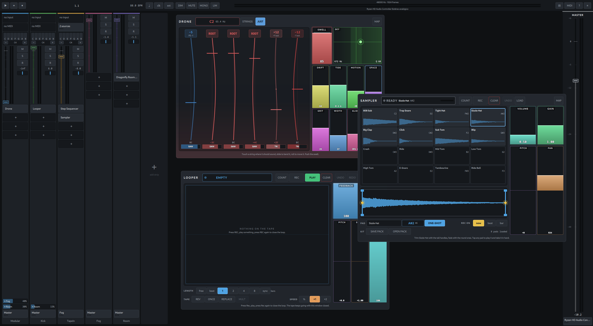

# Nirbija

A Linux mixer that is also an instrument. A drone synth, a sixteen-pad sampler,
a looper, a step sequencer and an arpeggiator live inside it and need nothing
installed — and LV2, CLAP and VST3 go in the same slot, over JACK or PipeWire,
with the plugins' own editors embedded in the window.



<https://zednaked.github.io/nirbija-site/>

## What it is

A rack of channel strips, in the spirit of AUM on iOS, which Linux does not
have. Each strip is a chain: an instrument, then effects, then a fader with
sends. MIDI made by one plugin joins what the next one in the chain receives,
so a step sequencer above a synth plays it.

The difference from the other hosts is that a session does not start empty. The
instruments below ship with the binary.

## Built in

| | |
|---|---|
| **Drone** | six strings that never stop, just intonation, per-string cents, swell, drift |
| **Sampler** | sixteen pads; record from the strip or load a file; the sequencer reads the names; packs |
| **Looper** | punch on the exact frame of the bar, reverse, half/double, multiply, replace, once; undo per phrase |
| **Step Sequencer** | sixteen steps, eight lanes, swing, scales, reverse/pendulum, chance, ratchets, ties |
| **Arpeggiator** | up, down, up-down, as played, random, chord; octaves and latch |
| **Chord** | split keyboard; below the split, one key fires a whole chord |
| **FX Pad** | sixteen graduated effects; pitch, filter, comb and ring go both ways |
| **Script** | a MIDI plugin you write in Lua, in the mixer |
| **File Player** | a file into a strip |
| **Computer Keyboard** | GarageBand-style typing keyboard; no MIDI hardware needed |

They sit in the picker with everything else you have installed.

The **Drone** also builds as a standalone CLAP (`build/clap/Nirbija Drone.clap`)
for other hosts. Copy it into `~/.clap`; it is not part of the install.

## Made to be played

**Scenes.** A song is a row of scenes across the top of the mixer: intro,
groove, break, drop. A scene holds only what changes from one part to the
next — which strips play, where their faders sit, which pattern each
sequencer is on, where a plugin's knobs are, built-in, LV2, CLAP or VST3 —
and how many bars the way there takes. You record one by touching: light
Record scene and move what should change, on the mixer or in the plugin's
own window. The list walks on by itself at the end of each part; a click or
Alt+1…9 jumps to another on the next bar line, and Hold repeats the one
playing. Touching a control while a scene walks it takes it back until the
next part.

The bar for the audio path is a live set: you edit while it plays and nothing
may click, step or drop out.

- **Nothing parks the master.** Looper Rec, Undo and Clear, the autosave,
  undoing a strip, loading a kit — none of them pause the audio. The looper
  keeps its undo by copying each frame just before it is overwritten, on the
  audio thread, so an undo is one pointer swap.
- **Every change is a slope.** Faders, pans, sends, mutes, solos, bypasses,
  plugin delay compensation, the looper's wrap and punch edges, a sampler pad
  retriggered — each walks or crossfades instead of jumping, and a test in
  `tests/` measures the largest sample-to-sample step and fails above it.
- **Sample-accurate time.** Scenes and pattern changes land on the frame of
  the bar line, gates and ratchets on their frame, the looper's punch and
  the metronome's click on their beat rather than the start of the block.
- **A cheap callback.** Sixteen strips with inserts and sends render a
  256-frame block in about 0.1 ms, 2% of its time, and a scene fading 64
  controls at once adds under a microsecond (`tests/render_bench.cpp`). No allocation, no lock, no log on the audio
  thread; memory is locked and the graph's own latency is reported to JACK.

## Also in the box

**Sampler packs.** `sessions/packs/` holds three kits for the Sampler editor's
**Open Pack**: *808 Trap*, *Techno Clang* and *Long Chops*, sixteen recorded
phrases to trim and chop.

**Bluetooth LE MIDI.** PipeWire advertises a BLE keyboard as a JACK port and
then never delivers its events; Nirbija talks to the device itself.

**Strips as files.** A chain worth keeping goes in a file of its own — click a
strip's name for **Save strip…**, right-click `+ add strip` for **Load strip…**.
Every plugin's state travels with it, so a sequencer arrives with its pattern. A
plugin the file wants and this machine does not have is named on screen, and the
rest of the strip still loads.

**A recorder**, on the master or any strip.

## Install

The [releases page](https://github.com/zednaked/Nirbija/releases) has an
AppImage that carries its own Qt and runs anywhere:

```sh
chmod +x nirbija-0.4.0-x86_64.AppImage && ./nirbija-0.4.0-x86_64.AppImage
```

On Arch, `makepkg -si` in `packaging/` builds a package from git.

`packaging/dist.sh all` makes the same AppImage and tarballs locally, in
`dist/`. From a build tree:

```sh
cmake --install build --prefix ~/.local
```

The binary, the launcher, the icons and the AppStream metadata.
`packaging/README.md` has the desktop and Hyprland side of it.

For the audio thread to lock its memory the user needs a memlock limit: on
Arch, the `realtime-privileges` package and the `realtime` group; elsewhere,
the `audio` group or a line in `/etc/security/limits.d/`. Without it Nirbija
still runs and says so once at startup.

## Build

Needs C++20, CMake ≥ 3.28, Ninja, JACK (`pipewire-jack` is fine), libsndfile,
lilv, Lua 5.4, Qt6 Quick and Widgets, and X11. libsystemd is only for
Bluetooth LE MIDI and `-DNIRBIJA_BLE_MIDI=OFF` drops it.

```sh
cmake --preset dev          # Release, LTO, the UI; see CMakePresets.json
cmake --build --preset dev
__GLX_VENDOR_LIBRARY_NAME=mesa ./build/src/ui/nirbija
```

`CMakePresets.json` names every tree: `dev`, `debug`, `release` (what the
AppImage ships), and `asan`, `asan-ui` and `tsan` for the sanitizers.

The app runs on X11/XWayland so plugin editors can embed (`QT_QPA_PLATFORM=xcb`
is forced). OpenGL editors often want that `__GLX_VENDOR_LIBRARY_NAME=mesa`.

Plugin editors are X11 windows of their own and want to float rather than tile.
Under Hyprland the app arranges that itself at startup, over the compositor's
IPC socket; `NIRBIJA_NO_WM_RULES=1` turns it off. Other compositors want the
rule by hand.

`nirbija --version` reports which backends the binary carries; `nirbija --help`
lists the environment variables it reads.

## Using it

Every control answers a drag, the wheel and the keyboard: Shift makes a drag ten
times finer, one notch of the wheel is a decibel on a fader, and Tab reaches the
faders, pans, sends and slots in turn. `F1` lists the lot.

The whole interface is sized off one number. **Ctrl+=** and **Ctrl+-** move it
while the mixer is open, **Ctrl+0** goes back, and the size is remembered for
that machine — a 4K panel and a laptop want different answers and neither is a
property of the session. `NIRBIJA_UI_SCALE=1.25` sets it at startup and wins
over the remembered one.

## Tests

```sh
ctest --test-dir build --output-on-failure
cmake --build build --target nirbija_ui_qmllint   # expected to stay silent
```

Every test carries a label: `quick` (offline DSP, graph and instruments — runs
anywhere), `jack` (needs a running server), `ui` (Qt, offscreen) and `plugins`
(opens what is installed on this machine). A test whose server or plugin is
missing **skips** (CTest 77) instead of passing, and every test has a timeout.

```sh
ctest --test-dir build -L quick               # what the pre-push hook runs
NIRBIJA_BENCH_STRICT=1 ./build/tests/nirbija_render_bench
```

Every `git push` compiles and runs the quick suite under AddressSanitizer and
UndefinedBehaviorSanitizer first — some twenty seconds, incremental — and CI
runs everything on each push, plus ThreadSanitizer and the Qt interface. See
[`CONTRIBUTING.md`](CONTRIBUTING.md) to set that up.

## Notes

| | |
|---|---|
| `PLAN.md` | what was decided and why, phase by phase |
| `PORTING.md` | what a Mac or Windows port would cost, measured |
| `ECOSYSTEM.md` | what the free plugin world is missing, counted |
| `design/` | designs for things not built yet |
| `CHANGELOG.md` | what changed in each release, and why |

## Licence

GPLv3. The full text is in [`LICENSE`](LICENSE).

Copyright (C) 2026 Nirbija contributors.

The choice is not ideological, it is forced: Nirbija hosts VST3 through
Steinberg's `pluginterfaces`, which ships under a GPLv3 / proprietary dual
licence. Hosting it in a project that is not proprietary means GPLv3.
