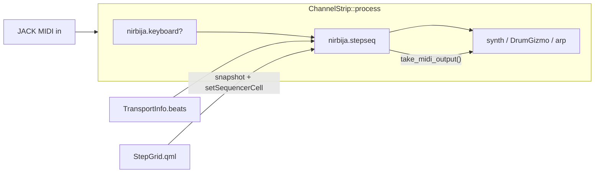
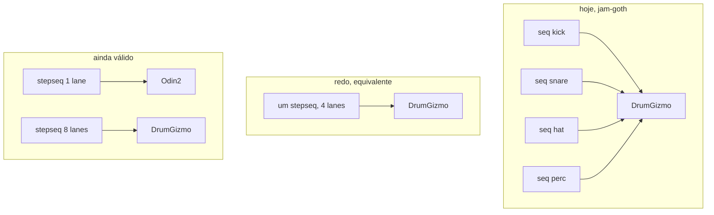

# Super Sequencer — redo do `nirbija.stepseq`

| | |
|---|---|
| Autor | — |
| Data | 2026-08-19 |
| Estado | Accepted, rev. 5 |
| Substitui | `design/sequencer.md` (primeiro corte, desactualizado face a `src/core/step_sequencer.cpp`) |
| UID | `nirbija.stepseq` (o mesmo; é um redo, não um segundo plugin) |

## Overview

O Step Sequencer actual é uma linha de 16 passos, monofónica de propósito,
com probabilidade, acento, tie, euclid e Record. Resolve o buraco que
`ECOSYSTEM.md` abriu — gerar MIDI, não filtrar — e o host não precisou de
nada: `TransportInfo`, `take_midi_output()` e a cadeia em
`channel_strip.cpp` já estavam ligados. O tecto é o modelo. Dezasseis
passos num array que nunca cresce, uma nota no ar, um `playhead()` que
devolve um `int`. Empilhar quatro instâncias à frente do DrumGizmo
(`sessions/jam-goth.json`) disfarça a monofonia; não dá polymeter, não dá
FILL, não dá um segundo cabeçote a ler a mesma linha.

O redo é um **instrumento de faixas**. Oito lanes, sessenta e quatro
passos, dezasseis padrões, um botão FILL, condições à Elektron, ratchets e
microtiming. Quatro cabeçotes extra à Fugue ocupam o mesmo blob desde o
PR 1; o motor deles pode escorregar para depois do primeiro corte que
toca — o array não volta a crescer. Continua a ser um `PluginInstance`
interno, zero áudio, `PluginKind::MidiEffect`, no mesmo slot, a
alimentar o insert seguinte. Não é um piano roll. Não é um clip
launcher. Não é uma suíte Rozeta. É a coisa que faz um strip tocar
sozinho bem o suficiente para o ritmo e o baixo deixarem de pedir um DAW.

## Background & Motivation

### O que o código é hoje

Lido em `src/core/step_sequencer.h` / `.cpp`, `src/ui/qml/StepGrid.qml`,
`tests/step_sequencer_test.cpp`. `design/sequencer.md` descreve o primeiro
corte e já está atrás: não menciona swing, direcção, escala, euclid,
acento, tie, Record, nem a editora própria.

Factos, não o desenho antigo:

- Plugin interno, `audio_inputs = 0`, `audio_outputs = 0`,
  `kind = MidiEffect`, UID `nirbija.stepseq`.
- `kSteps = 16` fixo. `length` é 1–16; o array não cresce. O redo
  parte isto em `kVisibleSteps = 16` (shim e testes de ID 16–191) e
  `kMaxSteps = 64` (o array).
- Monofónico de propósito: `sounding_note_` é um `int`, um passo novo
  corta o anterior a menos que `tie` segure o mesmo pitch.
- Por passo, atómicos: `note_`, `velocity_`, `active_`, `probability_`,
  `accent_`, `tie_`.
- Globais: division (1/4, 1/8, 1/16, 1/32, 1/4T, 1/8T), length, gate,
  transpose, canal MIDI, swing, direction (fwd/rev/pendulum/random),
  scale+root, euclid pulses, record arm.
- Ops como bang (`value >= 0.5`, lê de volta 0): nudge L/R, randomize
  hits, randomize notes, clear hits.
- Posição vem de `transport.beats`. Nunca de contador próprio.
  `transport.changed` e `!playing` soltam a nota no ar. `rolling` sozinho
  não dispara — o metrónomo não é Play (`CHANGELOG.md` 0.4.0).
- Record: MIDI que chega em `queue_midi` estala no passo mais próximo; um
  hold que atravessa passos vira ties. O padrão cala-se enquanto está
  armado. O que se toca passa na mesma.
- Estado: blob de texto, `division …` / `step note vel on [prob acc tie]`.
  Tokens a mais são campos novos; um blob 0.3 ainda carrega.
- UI: `StepGrid.qml`, popup não-modal, skyline de pitch, faixa de chance,
  faixa de velocity, tick de acento, notch de tie. `ParamEditor.qml` é o
  fallback — 16 globais + 16×6 = ~112 parâmetros, IDs cravados no QML
  (`idStepNote: 16`, `idStepVelocity: 48`, …).
- `playhead()` é um `int` atómico. O QML puxa em timer de 50 ms via
  `Mixer.insertPlayhead`.
- MIDI da cadeia anterior passa intacto (`queue_midi` copia para
  `events_`). `kMaxEvents = 64`. A strip tem `midi_chain_` de 256.
- Sessão e strip file guardam o blob opaco em base64. `jam-goth.json` e
  `jam-techno.json` dependem disto.

O laço em `process()` está certo e fica: fronteiras de passo dentro do
bloco, `beat_of` aplica swing nos ímpares, `map_step` aplica direcção,
`frame_for` converte batida em frame, `last_step_beat_` impede replay
quando o host reporta o mesmo beat duas vezes. Os testes em
`tests/step_sequencer_test.cpp` cobrem o alinhamento de bloco, o beat
repetido, o chase-off, o passthrough, o swing, o reverse, o pêndulo, a
probabilidade 0, o acento, o tie, o euclid 8/16, o Rec, e o blob antigo.
Nada disso se deita fora.

### Por que o primeiro corte ficou curto

`ECOSYSTEM.md` Tier 1 item 1 já nomeia o que ficou na mesa: Rozeta
Particles, Fugue Machine, Playbeat/Riffer, Atom 2, «probabilidade por
passo [agora existe], múltiplos cabeçotes de leitura, geração por regra».
A probabilidade chegou. O resto não cabe em 16 passos e um cabeçote.

A dor concreta, da sessão e da editora:

1. **Um kit é quatro plugins.** `jam-goth.json` empilha quatro
   `nirbija.stepseq` antes do DrumGizmo, cada um uma voz. Funciona porque
   o host encadeia MIDI. Não dá a uma lane length 12 e à outra 16. Não dá
   um FILL que as quatro ouçam. Não dá um cabeçote a ler a linha do
   baixo ao contrário.
2. **O 303 e o 808 estão no mesmo widget, mal.** Skyline de pitch é o
   instrumento certo para uma linha. Uma grelha de pads é o instrumento
   certo para um kit. `StepGrid.qml` é só o primeiro. Pintar um groove de
   quatro vozes exige quatro janelas.
3. **112 parâmetros são o tecto errado.** Expor o grid como `parameters()`
   deu UI de graça no dia 1 e MIDI learn de graça. Uma grelha 8×64 com
   p-locks não entra nessa interface. O `ParamEditor` já é «prova que
   funciona e não é maneira de tocar» (`StepGrid.qml:8`).
4. **`playhead()` de um `int` não acende oito lanes.** O host puxa um
   número. Qualquer redo com mais do que uma leitura precisa de um
   snapshot no Mixer, no molde de `looperWaveform` — não de um hook
   novo em `plugin.h`.
5. **Sessões antigas não podem calar.** O blob é a API. `load_state` de
   um 0.3/0.4 tem de continuar a produzir a mesma linha na lane 0.

## Goals & Non-Goals

### Goals

- Um instrumento só, no UID `nirbija.stepseq`, que cubra linha (303) e
  kit (808) sem ser a união de todos os sequenciadores.
- Arrays fixos. `process()` sem heap, sem mutex, sem I/O. Atómicos de
  escalar entre UI e áudio, como hoje.
- Sessão 0.3/0.4 carrega. Strip file antigo carrega. A linha volta na
  lane 0, padrão 0; lanes 1–7 mudas **e vazias** (um jam empilhado
  não ganha um hat). Instância *nova*: 1–7 mudas com hits de fábrica,
  soltar o mute dá um kit.
- Superfície de parâmetros honesta: globais 0–15 estáveis, macros de
  performance, bangs. O grid não entra em `parameters()`.
- Editora QML não-modal, touch-first, mixer vivo. Dois modos no mesmo
  sítio: skyline (uma lane) e grelha (kit). `Ctrl+=` continua a valer.
- Testes offline, transporte sintético, contar eventos e frames. Cada
  mecanismo novo tem forma de teste descrita aqui.
- Host quase intocado. A plumbing MIDI não se reinventa.

### Non-goals

- Clip launcher, session view, arrangement, segundo mixer.
- Piano roll (Atom 2, Helio, LMMS). O desktop livre já tem isso.
- Lua dentro do sequenciador. `nirbija.script` já é a válvula.
- Suíte Rozeta (Bassline / Rhythm / Particles / Collider como UIDs
  separados).
- Parameter locks de synth. Não somos a máquina que toca o som; somos
  MIDI a alimentar o insert seguinte. Travar cutoff por passo é trabalho
  do synth, ou de um script à frente.
- Song mode / chain de padrões para além de «próximo padrão na barra».
- Extração CLAP neste redo. Interno primeiro, como `ECOSYSTEM.md` já
  mandou.
- Relógio próprio. Posição continua a ser `transport.beats`.

## Prior art — o mecanismo, não o nome

Para cada sistema: o problema que resolveu, o mecanismo mais pequeno que
carrega a ideia, e se cabe num plugin de arrays fixos num strip.

### Hardware / standalone

**Elektron (Digitakt / Analog Four / Octatrack / Analog Rytm).**
Problema: um padrão de 16 passos é curto demais para um tema, e
probabilidade crua não dá um fill que se pisa. Mecanismo: o *trig* é a
unidade, não a nota. Em cima do trig: parameter lock (valor por passo),
conditional lock (`FILL` / `!FILL` / `PRE` / `!PRE` / `NEI` / `A:B` /
`1:N` / `%`), microtiming (±1/384), retrig/ratchet, page length por
track (polymeter). Pattern+kit separados; song mode é outra camada.
O que cabe: trig + condição + microtiming + ratchet + FILL como latch +
length por lane. O que não cabe: p-lock de parâmetros do synth (não
são nossos); song mode; 128 passos × 16 tracks × cada knob do som.
`PRE` é barato: um bool `last_fired` por cabeçote. `A:B` é um contador
de voltas. `FILL` é um atómico que a UI pisa.

**Teenage Engineering OP-Z / OP-1.**
Problema: 16 passos × 16 tracks é pouco, e o live precisa de FX que não
estão no padrão. Mecanismo: *step components* (instruções por passo:
pulse, hold, jump, skip, ratchet, random) e punch-in FX numa track à
parte, graváveis no passo. Parameter lock nos dials, por passo.
O que cabe: pulse/hold já são o nosso gate+tie; skip periódico é `A:B`;
jump é um cabeçote a saltar — fora de v1. Punch-in FX é o FX Pad no
strip, não o sequenciador. Step components como linguagem de um passo
é o OP-Z inteiro; não copiamos o vocabulário, extraímos condição +
ratchet.

**Squarp Pyramid / Hapax.**
Problema: um projecto é muitas tracks com lengths diferentes, e a
geração (euclid, chance, arp) quer viver *depois* da escrita, não em
vez dela. Mecanismo: length por track (1 passo a 32 compassos), 16
padrões por track, MIDI FX em cadeia (Euclid, Chance, Scale, Swing,
Arp). Polymeter é o length, não um modo especial.
O que cabe: length por lane, euclid por lane (já temos um euclid
global), scale+swing globais. MIDI FX em cadeia é o host: arp e script
já sentam no slot seguinte. Não cabe o Hapax (16 tracks, MPE, um milhão
de notas).

**Polyend Play / Tracker.**
Problema: o groovebox de performance precisa de variações instantâneas
e de um fill que não é outro padrão. Mecanismo: 128 padrões × 16 tracks
× 16 variações por track; Fill gera um groove no sítio; variação troca
já ou no fim do padrão.
O que cabe: banco de 16 padrões, FILL como condição (não como gerador
mágico de rumba), variação = outro padrão. 30 000 variações são um
produto, não um plugin.

**Synthstrom Deluge.**
Problema: o mesmo hardware tem de ser kit e synth, e uma row de kit
quer length e direcção próprias. Mecanismo: kit = rows (cada pad uma
row com probability, iteration, euclid, length, direction); synth =
piano roll; song arrange à parte; audio clips à parte.
O que cabe: lane = row de kit. Probability já existe. Iteration é
`A:B`. Euclid por lane. Song arrange e audio clips não.

**Roland TB-303 vs TR-808/909.**
Problema: são os dois arquétipos, e o plugin actual rasga-se ao meio.
303: uma voz, accent, slide/tie, uma nota por passo, pitch como
skyline. 808: grelha de pads, uma row por som, accent, sem slide, sem
melodia. O `StepGrid.qml` é um 303. O `jam-goth.json` é um 808 feito de
quatro 303.
O que cabe: os dois, no mesmo motor, com um interruptor de vista. Lane
com tie+pitch = 303. Oito lanes com nota fixa por lane = 808. Não é um
terceiro arquétipo.

**Novation Circuit / Ableton Push session.**
Problema: lançar ideias em grelha, não programar passos. Mecanismo:
clip slots × scenes. Um pad dispara um clip; uma cena dispara uma
linha.
O que não cabe: é o clip launcher que este documento recusa. Padrão
seguinte na barra é o máximo. Quem quer scenes empilha strips e usa o
mixer.

### Software que resolveu geração / probabilidade / multi-head

**Rozeta (Bram Bos) — Bassline, Rhythm/XOX, Particles, Arpeggio,
Collider.**
Problema: o AUM no iPad não tinha quem *gerasse* MIDI; a suíte é o que
faz o AUM ser AUM (`ECOSYSTEM.md`). Mecanismo, partido por plugin:
Bassline é o 303 de 16 passos com triplets e um pouco de polirritmia;
Rhythm/XOX é euclid para bateria, com presets de mapa MIDI para kits;
Particles é um gerador de nuvem (notas a saltar nas paredes);
Arpeggio é o arp que já temos em `nirbija.arp`; Collider é um
sequenciador a colidir com outro.
Por que a suíte existe no iPad: cada AUv3 é uma janela minúscula com
uma ideia. No Nirbija a editora é uma janela de ferramenta nossa, e o
script já cobre «escreve o gerador». Bassline + Rhythm cabem num
instrumento de faixas com dois modos de vista. Particles como física
2D não cabe e não é um step sequencer. Collider é dois cabeçotes.

**Fugue Machine (Alexandernaut).**
Problema: uma melodia só anda para a frente. Mecanismo: um piano roll,
até quatro (Classic) ou oito (Rubato) cabeçotes, cada um com
direcção, velocidade, transposição, start, length independentes. A
ideia é Bach: a mesma linha, várias leituras.
O que cabe: N cabeçotes extra a ler uma lane existente, com rate
`{1, 2, 1/2, 1/3, 3/2}`, direcção, start, length, transpose, mute.
Não cabe o piano roll debaixo. A lane *é* a linha. Quatro extra, não
oito — o bloco MIDI da strip é 256 eventos.

**Stochas (GPL, Surge Synth Team; nasceu do JSFX Stochasticizer).**
Problema: o Linux não tem Rozeta Rhythm. Mecanismo: grelha polifónica
(até 125 rows × 64 passos), 4 layers com length/speed próprios
(polirritmia), 8 padrões, probabilidade por célula, humanize
(desvio de tempo/velocity/length), chords, chain mode («se esta nota
tocou, aquela não»), groove importado de MIDI.
O que cabe: 8 lanes não 125 rows — 125 rows é um piano roll
probabilístico, e o desktop já tem Stochas como plugin. Layers com
length próprio = as nossas lanes. Chain mode é `PRE`/`!PRE` e `NEI`.
Humanize grosso = macro Chaos + microtiming por passo. Chords por
célula: não. Uma célula dispara a nota da lane; polifonia é lanes a
mais, ou um acorde no synth. Não reimplementar o Stochas.

**Bitwig Note Grid / clip launcher / Note FX.**
Problema: o DAW quer um modular de notas. Mecanismo: patcher de
módulos (clock, gate, pitch) que gera ou processa MIDI, clip launcher
à parte, Note FX na cadeia do clip.
O que não cabe: é um ambiente, não um plugin de strip. A cadeia de
inserts *é* o nosso Note FX (seq → arp → script → synth). Não se
constrói um Grid.

**Renoise / OpenMPT (trackers).**
Problema: uma coluna é uma voz, e o efeito vive na coluna do lado
(`Dxx` delay, `Vxx` volume, `Exx` …). Pattern order list é o song.
Mecanismo: colunas de efeito por passo, delay column = microtiming em
1/256, order list.
O que cabe: microtiming por passo (a delay column, sem a linguagem de
hex). Order list = song mode, recusado. Não vamos falar hex.

**Mutable Instruments Grids + euclid de Toussaint.**
Problema: programar um groove à mão é lento; um euclid puro não soa a
casa-de-máquina. Mecanismo: Grids tem um mapa 2D aprendido de loops
reais (X/Y escolhem o esqueleto) e um FILL por canal que densifica;
Chaos injeta ghost notes. Euclid (Toussaint 2005) espalha *k* hits em
*n* passos o mais uniformemente possível — já está em
`fill_euclidean()`.
O que cabe: euclid por lane (upgrade do global). Macros Density e
Chaos no papel dos knobs FILL/CHAOS. O que não cabe: o mapa aprendido
— é um blob de dados e uma identidade diferente. Quem quiser Grids
instancia Cardinal.

**Orca / TidalCycles.**
Aviso, não modelo. Orca é uma linguagem 2D; Tidal é live-coding de
padrões. Os dois param de ser um step sequencer no momento em que o
utilizador escreve um programa. Temos `nirbija.script` para isso. O
sequenciador não ganha um interpretador.

**Hydrogen, Helio, LMMS.**
O que o desktop livre já tem, para não reconstruirmos um DAW.
Hydrogen: drum machine com pattern editor + song editor, aplicação.
Helio: piano roll e tracker, aplicação. LMMS: piano roll + song
editor + instrumentos, aplicação. Nirbija é o mixer. O sequenciador
vive no slot e toca o que está abaixo. Não se abre um song editor.

**Cardinal / VCV sequencers.**
Modulares. O relógio, o reset, o CV, o quantizer são módulos à parte.
O nosso relógio é o transporte do host. Não se simula um patch.

**x42 `stepseq.lv2` (`http://gareus.org/oss/lv2/stepseq#s8n8`).**
Já aparece em `sessions/jam-slag.json` e `jam-kick-cloud.json`: grelha
8 notas × 8 passos, LV2, MIDI. É a prova de que o buraco «kit numa
grelha» é sentido nesta máquina, e de que a gente já chega a um LV2
externo quando o interno não dá. O redo tem de tornar esse desvio
desnecessário para o caso 8×N, sem tentar ser o x42 (que tem variantes
8×8, 8×16, 16×16, e é um plugin à parte).

**`nirbija.script`.**
A válvula. Compila tabelas na UI, a thread de áudio só indexa
(`design/scripting.md`, variante C). Cobre escala, acorde, curva,
roteamento. Não reage à nota que acabou de chegar. Significa: o
sequenciador **não** precisa de se tornar uma linguagem. Geração por
regra que não caiba num bang (mutate, euclid, randomize) vai para um
script no slot seguinte, ou fica de fora.

### O que isto não é, dito uma vez

Não é o Ableton. Não é o Deluge. Não é o Stochas com skin nossa. É um
gerador que vive num slot, toca o que está abaixo, é tocável a dedo, e
cabe em arrays fixos no `process()`.

## Identidade

Um **instrumento de faixas**. Lane é voz ou pad. Oito lanes partilham o
transporte e o banco de padrões; cada uma tem length, divisão, direcção,
canal, mute, nota-base. Um passo guarda o trig. Quatro cabeçotes extra
lêem lanes já existentes (Fugue), não inventam lanes. Um FILL pisa as
condições `FILL`. Dezasseis padrões trocam já, ou na barra.

Isto absorve Bassline (uma lane, skyline, tie/accent) e Rhythm (oito
lanes, grelha, euclid) sem partilhar o UID. Density e Chaos pegam a
*ideia* dos knobs FILL/CHAOS do Grids (densificar, injectar ghost
notes) — não são Particles, e o prior art já o diz. Fugue vira os
cabeçotes extra, e esses podem escorregar para depois do corte 1.
Playbeat vira o bang Mutate. Atom 2 fica no DAW.

Uma instância é uma *parte*. Um kit de bateria é uma instância à frente
do DrumGizmo. Um baixo é uma instância à frente do Odin, sete lanes
mudas. Empilhar instâncias continua a ser um feature do host
(`kMaxInserts = 16`): dois kits, ou baixo + kit, ou o `jam-goth.json`
migrado (quatro instâncias de uma lane cada, ainda tocam). Não se
deita fora o «uma voz por plugin»; deixa de ser a única maneira de ter
quatro vozes.

## Key Decisions

1. **Um plugin, o mesmo UID `nirbija.stepseq`.** Redo com migração, não
   suíte e não `nirbija.polyseq`. Cultura do repo: um interno que faz o
   trabalho (`plugin.cpp` `InternalBackend`). A suíte Rozeta existe
   porque cada AUv3 é uma janela minúscula; a nossa editora é uma e é
   nossa. `nirbija.script` já é a válvula para geradores exóticos.
   Segundo UID partia as sessões e o picker.

2. **Lane = voz, não row de piano roll.** 8 lanes × `kMaxSteps = 64`
   × `kPatterns = 16`. `kVisibleSteps = 16` é o shim e o tecto de todos os
   testes que ainda falam IDs 16–191. Polifonia é lanes a disparar ao
   mesmo tempo, cada uma monofónica no próprio cabeçote. Não há 125
   rows à Stochas. 64 é o último número de passos que escolhemos —
   16 foi o canto em que o primeiro corte se pintou.

3. **Dados completos no dia 1, motor por fases.** O struct de passo já
   nasce com microtiming, ratchet, condição, lock de nota. Padrões e
   cabeçotes extra já ocupam o array. **Corte 1 = PRs 1–4**: 8×64
   audível, editora snapshot, Density/Prob, v1 ainda soa. Banco com
   troca instantânea é o PR 5, não o corte 1. Não se volta a crescer
   o array no áudio.

4. **Parâmetros 0–15 ficam, com uma mudança semântica dita.**
   Division, length, gate, channel, direction, bangs, euclid, Rec
   passam a ser da **lane focada**. Transpose, swing, scale, root
   ficam globais. Um MIDI map antigo de «Steps» (id 1) escreve a
   lane que estiver focada — isso sente-se, não é «um learn antigo
   não parte». IDs 16–191 deixam de ser listados em `parameters()`;
   `set_parameter` / `parameter_value` ainda os mapeiam **sempre**
   para lane 0 / padrão 0 / passos 0–15, para um learn de «Step 1
   note» não virar Density. Macros e o resto nascem em **192+**.
   Não se reserva o id 202.

5. **O grid não é parâmetro.** A editora fala por métodos *tipados*
   no Mixer (`insertSequencerSnapshot`, `setSequencerCell`, …), no
   molde de `looperWaveform` / `setLooperTrim` / `setFxPad` —
   `dynamic_cast` para `StepSequencerInstance`, sem `QString& field`
   e sem 5 k `QVariant`s. `ParamEditor` passa a mostrar ~25
   controlos úteis em vez de 112 inúteis. MIDI learn e automação
   vêem globais, macros, FILL, padrão, bangs.

6. **`playhead()` fica o passo da lane focada.** Não se estende
   `PluginInstance`. Cabeçotes extra vivem no snapshot do Mixer, como
   `looperWaveform` já faz para um array que `playhead()` não cabe.
   Extração CLAP é non-goal; um hook no contrato «para um consumidor
   que não é o Mixer» é um consumidor que não existe.

7. **Sem p-lock de CC/synth.** O sequenciador emite note on/off. Acento
   é velocity +27, como hoje. Quem quiser CC por passo põe um script
   a seguir. Elektron trava o som porque *é* o som.

8. **Sem song arrange.** Banco de 16, troca instantânea, `next_pattern`
   quantizado à barra do host: `floor(beats / numerator)`, o mesmo
   relógio que o looper e o metrónomo (`engine.cpp`, `looper.cpp`).
   `numerator` está em semínimas; o denominador não entra — em 6/8 a
   «barra» é de 6 semínimas, não de um compasso correcto. Polymeter
   não espera que as oito lanes fechem.

9. **Cabeçotes extra são leitores, não lanes, e podem escorregar.**
   8 nativos (um por lane) + 4 extra. Extra aponta para uma lane, com
   rate/direcção/start/length/transpose/mute. O array e o blob
   existem desde o PR 1. O motor é o PR 9 e **não faz parte da
   identidade do primeiro corte que toca**. Sem ele ainda há
   Bassline+Rhythm+FILL. Com ele há Fugue.

10. **Empilhar continua certo.** Uma instância polifónica não obriga a
    fundir o `jam-goth.json`. Quatro lanes mudas + uma a tocar é um
    baixo. Quatro instâncias de uma lane é o ficheiro antigo a tocar.
    Fundir à mão, se alguém quiser; não há ferramenta de colapso em v1.

11. **Ratchet é retrigger no mesmo cabeçote, não vozes a mais.** Cada
    cabeçote tem um slot `{pitch, channel, off_beat}` — 12 slots, não
    32. Pulso seguinte faz note-off no canal *gravado* e note-on no
    mesmo pitch. Dois números: `pulse_spacing = step_beats / N`,
    `pulse_dur = gate * spacing`. Tie força N=1. Rec-arm, mute,
    `!playing` e `changed` cancelam o scheduler (`ratchet_left = 0`
    + chase-off). O scheduler vive ao lado de `sounding_off_`, não
    no walk de `last_step_beat_`.

12. **Construtor: lane 0 toca; 1–7 mudas com hits.** Lane 0 é a walk
    pentatónica de hoje. Lanes 1–7 nascem mudas, notes GM, com um
    padrão de fábrica (ver Lane) — soltar o mute dá um kit, não uma
    row vazia. Isto é comportamento do PR 1, não gosto posterior.

## Proposed Design

### Forma

Continua `StepSequencerInstance : PluginInstance`. Continua no
`InternalBackend` de `plugin.cpp`. Continua a abrir por
`Mixer.insertIsStepSequencer` → `StepGrid.qml` (`Main.qml:270`). Zero
áudio, MIDI in (passthrough + Record), MIDI out via `take_midi_output`.



O host não muda o caminho MIDI. `run_insert` em `channel_strip.cpp:58`
já faz `set_transport` → `queue_midi` → `process` → `take_midi_output`
para o próximo. O tecto da strip é 256 eventos por bloco; o plugin
sobe `kMaxEvents` de 64 para 128.

### Capacidades e orçamento

| Recurso | Número | Notas |
|---|---:|---|
| Lanes | 8 | voz ou pad |
| Passos por lane | `kMaxSteps = 64` | UI mostra pages de `kVisibleSteps = 16` |
| Shim / testes de ID | `kVisibleSteps = 16` | IDs 16–191; `for (i < kSteps)` nos testes velhos vira `i < kVisibleSteps` |
| Padrões | 16 | `kPatterns`; troca já (PR 5) ou na barra (PR 8). Snapshot = padrão corrente, não os 16 |
| Cabeçotes nativos | 8 | um por lane |
| Cabeçotes extra | 4 | lêem uma lane existente; motor no PR 9 |
| Notas no ar | **12** | uma por cabeçote (8+4). Ratchet não soma vozes |
| Eventos MIDI por bloco | 128 | `kMaxEvents`; a strip tem 256 |
| Capture slots (Record) | 8 | um hold aberto por lane |
| Macros | 4 | Density, Chaos, Ratchet, Prob |

Passo, atómicos de escalar como hoje — probabilidade **fica float 0–1**,
igual ao v1, aos testes (`parameter_value(112+2) == 0.25`) e ao token
`1.0000`. Não se empacota 0–255.

```
// por (pattern, lane, step); cada campo um atomic
int   note;          // 0–127; 255 = usa lane.note (unlocked)
int   velocity;      // 1–127
bool  active;
float probability;   // 0–1
bool  accent;
bool  tie;
float microtiming;   // −0.5 .. +0.5, fracção do passo
int   ratchet;       // 1–8; 0 e 1 = um hit
uint8_t condition;   // enum Cond
uint8_t cond_arg;    // A:B empacotado
```

`note == 255` *é* o unlocked; não há um `flags` à parte. Um 303 pinta
0–127 (locked). Um 808 deixa 255 e muda `lane.note`.

Memória, 4 bytes por atómico:

```
16 padrões × 8 lanes × 64 passos × 10 campos × 4 B  ≈ 320 KiB
+ lanes + 4 heads extra + 12 vozes                       ≈ 2 KiB
```

Quatro instâncias empilhadas: ~1,3 MiB. Cabe. Não se aloca em
`process()`. Trocar de padrão é um `atomic<int>`; o áudio indexa.

Tecto de eventos no bloco: 12 cabeçotes × (1 fronteira + pulsos de
ratchet que caem neste bloco). 256 frames a 48 kHz / 120 bpm ≈
**0,0107** beats (não 0,13 — isso era um bloco ~20× maior). 1024
frames, período JACK comum, ≈ 0,043 beats. A 1/16 um passo é 0,25
beats; ratchet 8 espaça ons a 0,031, então um bloco de 1024 contém o
trig **e** o pulso 2. 12 × 2 × 2 (on+off) ≈ 48. Um bloco alinhado de
6000 frames (1/16 exacto) com ratchet 8 em 12 cabeçotes são 192
eventos — satura 128, `emit()` descarta, e o teste de saturação
existe para o dizer. O harness alarga o take para 128 no PR 2.

### Lane

Cada lane:

| Campo | Significado |
|---|---|
| `note` | pitch por omissão (pad de kit, ou a tónica da linha) |
| `length` | 1–64, polymeter. Independente das outras |
| `division` | o mesmo índice que hoje, tabela `kDivisions[]` |
| `direction` | fwd / rev / pendulum / random |
| `channel` | 0–15. Uma instância alimenta um kit multi-canal ou um synth |
| `mute` | a lane não dispara (nem ratchet); o cabeçote ainda anda (luz). Borda de mute: chase-off + `ratchet_left = 0` |
| `gate` | fracção do passo; tie ignora e segura até ao próximo |
| `euclid` | 0–length; bang que pinta `active` à Toussaint |
| `voice` | Mono (passo novo corta o anterior neste cabeçote) |

Lane 0 de uma instância fresca: a walk pentatónica actual
(`kSeed` em `step_sequencer.cpp:127`), length 16, division 1/16,
passos even on — o default de hoje.

Lanes 1–7, **PR 1, construtor**, mudas (`mute = 1`), length 16,
division 1/16, `note` unlocked (células a 255):

| Lane | GM | Hits de fábrica (0-based) |
|---|---|---|
| 1 | 38 snare | 4, 12 |
| 2 | 42 closed hat | even (euclid 8) |
| 3 | 46 open hat | 14 |
| 4 | 49 crash | nenhum |
| 5 | 51 ride | nenhum |
| 6 | 39 clap | 4 |
| 7 | 37 side-stick | nenhum |

Soltar o mute da snare e do hat dá um kit. As rows de perc vazias
continuam vazias — pintam-se. Deitar num strip de baixo toca a linha
da lane 0, como hoje. Um load v1 **não** pinta estas hits nas lanes
1–7: o blob antigo não as descreve; nascem mudas e vazias para o
`jam-goth` empilhado não ganhar um hat fantasma. O seed de fábrica
é só instância *nova*.

Length por lane é o polymeter do Squarp: kick em 16, hat em 12, o
transporte é o mesmo. Não há relógio privado.

### Passo

| Campo | Default | Papel |
|---|---|---|
| on | — | o trig existe |
| note | 255 = lane | 0–127 locked (303); 255 unlocked, usa `lane.note` (808) |
| velocity | 100 | |
| probability | 1.0 | float 0–1; AND com a condição e com a macro Prob |
| accent | off | +27 de velocity, como hoje |
| tie | off | 303 slide: não retrigger se o pitch não mudou; **força ratchet a 1** |
| microtiming | 0 | fracção do passo (−0.5..+0.5), depois do swing **deste cabeçote** |
| ratchet | 1 | 1–8 hits dentro da duração do passo |
| condition | Always | ver abaixo |
| cond_arg | — | `A:B` empacota A no nibble alto, B no baixo |

Um 303 pinta 0–127 por passo. Um 808 deixa 255 e muda a nota da lane.
Record e randomize **não** viram uma row de kit em skyline — ver
Record.

### Condições

Conjunto pequeno. Elektron tem uma lista longa; a que carrega o
instrumento:

| Cond | Dispara quando |
|---|---|
| `Always` | o passo está on e a probabilidade passa |
| `Fill` | FILL está baixo |
| `NotFill` | FILL não está baixo |
| `Pre` | o trig anterior *deste cabeçote* disparou |
| `NotPre` | o anterior não disparou |
| `Nei` | o cabeçote nativo da lane vizinha (lane−1, wrap) disparou a última vez que esse vizinho esteve neste índice |
| `AOverB` | volta `count % B == A−1`, A,B em `cond_arg` |

Probabilidade é independente e aplica-se depois. `A:B` cobre `1:2`,
`2:2`, `1:4`, a «iteration» do Deluge e o skip periódico do OP-Z.
`1st`/`Last` do Elektron ficam de fora — `A:B` faz o trabalho.
Percentagem Elektron é a nossa `probability`.

FILL é um atómico `fill_`. Parâmetro 192+ e botão na editora, MIDI
learnable. Momentary (pisa) ou latch (o parâmetro). A UI oferece os
dois: o botão é momentary enquanto o ponteiro está baixo e escreve o
parâmetro; um StripButton ao lado trava.

Dois arrays, papéis distintos. **Não** há `last_fired_index`.

- `last_fired[12]` — o último *visitado* deste cabeçote disparou?
  Serve `Pre` / `NotPre`.
- `last_on[kLanes][kMaxSteps]` — a última vez que o cabeçote nativo
  da lane passou pelo índice `i`, disparou? Serve `Nei`. Memória
  por célula, não «o último trig do vizinho, fosse qual fosse o
  passo» (Elektron puro). Num kit de lengths iguais, passo 4 pergunta
  se o kick soou no 4, não se soou no 3. Só o cabeçote nativo
  escreve; extra heads não. Áudio-thread only, como `sounding_note_`
  — a UI não pinta isto.

Cada visita do cabeçote nativo ao índice `i` escreve
`last_on[lane][i] = fired` e `last_fired[h] = fired`, **incluindo
misses** (passo off, prob 0, Chaos invert, mute). Só emitidos
deixaria os arrays sticky-true: o primeiro hit eternizava Pre/Nei.
Extras nunca escrevem `last_on`. Rec-arm não visita (o padrão está
calado) — os bits ficam como estavam.

No arranque de cada `process()`, copiam-se os dois para snapshot
local. **Toda** a avaliação de `Pre` / `NotPre` / `Nei` neste bloco
lê o snapshot. Commit no fim do bloco, depois de todos os cabeçotes.
Duas lanes no mesmo frame vêem a volta *anterior*. Polymeter: `Nei`
no índice `i` lê `snap[neighbor][i]`.

Teste: duas lanes length 16, passo 0 da lane 1 em `Nei`, passo 0 da
lane 0 a 50 %. Os disparos da lane 1 neste passo seguem o *último*
hit da lane 0 no índice 0, não o rng deste bloco. E: lane 0 passo 0
com prob 0 durante um compasso; na visita seguinte, lane 1 `Nei` no
índice 0 está calada. O mesmo para `Pre` no passo 1 do ciclo
seguinte.

### Cabeçotes

Cabeçote nativo da lane `i`: lê a lane `i`, rate 1, start 0, length =
lane.length, direcção = lane.direction. Mute da lane cala os disparos,
não a luz.

Cabeçote extra `h` (0–3):

| Campo | Valores |
|---|---|
| lane | 0–7 |
| rate | 1, 2, 1/2, 1/3, 3/2 (índice) |
| direction | fwd/rev/pendulum/random |
| start | 0–63 |
| length | 1–64 |
| transpose | −24..+24, soma ao transpose global |
| mute | |

Posição, sempre do transporte. A janela **dá a volta em `lane.length`**,
nunca indexa passado 63:

```
step_beats    = kDivisions[lane.division] / rate
index         = floor(transport.beats / step_beats)
window        = map_step(index, head.length, head.direction)   // 0 .. length-1
index_in_lane = (head.start + window) % lane.length
```

Setters: `start` clampa a `0 .. kMaxSteps-1`, `length` a `1 .. kMaxSteps`.
Se `start >= lane.length` na leitura, `start % lane.length`. Teste:
lane length 64, extra `start=48, length=16` reverse — o primeiro
disparo lê o passo 63, nunca 64+.

Swing é **por cabeçote**, não por instância: o índice ímpar do
relógio *não-swung* deste head atrasa `swing * head_step_beats * 0.5`.
Uma lane a 1/8 e outra a 1/16 swingam quantidades absolutas
diferentes. É o Elektron (swing no clock da track).

`last_step_beat_[head]` por cabeçote continua a guarda de *passo*
contra beat repetido. Não guarda pulsos de ratchet — ver motor.
`transport.changed` e `!playing`: chase-off das 12 vozes (off no
**canal gravado**), reset dos `last_step_beat_` e do scheduler de
ratchet. O padrão em si não reset — `beats` é a verdade.

Cada cabeçote tem no máximo uma nota no ar. Dois extra na mesma
lane empilham vozes (Fugue) — 12 no tecto, não 32. O 303 clássico é
uma lane, zero extra.

### Macros de performance

Quatro knobs, visíveis em `parameters()`, MIDI learn, automação,
`ParamEditor`. Não são o grid.

| Macro | Efeito no áudio |
|---|---|
| Density | 0–2. `p_eff = clamp(p_step * density, 0, 1)`. Acima de 1, passos *off* podem disparar com chance `density−1`, velocity 70 % — ghost notes à Grids, sem o mapa |
| Chaos | 0–1. Jitter de microtiming extra `± chaos * 0.25` passo, e um chance pequeno de inverter o hit (on vira off, off vira on) |
| Ratchet | 0–1. Multiplica o ratchet do passo: `1 + round((ratchet_step−1) * macro)`. 0 deixa o passo em 1 hit |
| Prob | 0–1. Tecto: `p_eff *= macro`. 1 é o neutro, 0 cala tudo |

Ordem de avaliação num trig, **fixa**:

1. mute da lane (e mute do extra, se for extra) — cala emit, luz anda
2. `on`, ou ghost de Density se `on` é false e `density > 1`
3. condição contra o snapshot de `last_fired` do *início* do bloco
4. `p_eff = clamp(p_step * density, 0, 1) * macro_prob` (Density acima
   de 1 já gastou o excesso em ghosts no passo 2; aqui satura em 1)
5. Chaos invert: com chance `chaos * 0.25`, troca o resultado do passo 4
6. emit (e arma o scheduler de ratchet)

Density e Prob ligam no corte 1 (PRs 1–4). Chaos e Ratchet no-op até
o PR 7; os knobs já estão no blob.

### Banco de padrões

`pattern` 0–15, atómico. O áudio lê `steps_[pattern][lane][i]`. Troca
instantânea: o próximo fronteira já é o padrão novo. Notas no ar
seguem o gate/tie que as abriu; não se chase-off numa troca (um kick
a meio do passo não corta). `next_pattern` −1 ou 0–15: quando `floor(beats / numerator)` sobe,
`pattern = next`, `next = −1`. `numerator` é o do host, em semínimas
— o mesmo que o looper e o metrónomo. O denominador não entra.

Não há chain, não há song. Dezasseis padrões são Elektron, não um Hapax.

Bang **Mutate** (UI thread, como `randomize_hits`): no padrão corrente,
por lane não muda, cada passo on tem 12,5 % de virar off e cada off
6 % de virar on; notas locked andam ±1 grau da escala. É o Playbeat
num botão, não um gerador autónomo.

Ops actuais (nudge, randomize hits/notes, clear, euclid) passam a
aplicar-se à **lane focada**, padrão corrente. Euclid deixa de ser um
global que pinta 16 passos: pinta `lane.length`.

`randomize_notes` numa lane **unlocked** (células a 255) **não** pinta
0–127 nas células: randomiza `lane.note`, na escala, e deixa 255. Numa
lane locked (303, alguma célula ≠ 255) randomiza as notas locked como
hoje e não toca nas unlocked. Nudge e clear não mudam `note`. Mutate
só anda pitch em células locked.

### Record

Mantém a semântica 0.4.0: armado, o padrão cala-se, o input passa, o
que se toca estala no passo mais próximo, hold atravessa e vira tie.

Regra de lock, para um kit não virar 303 no primeiro Rec:

- Célula **unlocked** (`note == 255`): Rec escreve `on`, velocity, tie.
  **Não** escreve `note`. A row continua a usar `lane.note`.
- Célula **locked** (0–127): Rec escreve o pitch capturado, como hoje.
- Hold que atravessa passos: as células spanned herdam o lock da
  primeira. Unlocked fica unlocked em todas.
- Roteamento (PR 8): pitch igual a `lane.note` de uma lane (sem
  transposição extra; o transpose global não conta para o match)
  cai nessa lane e **não** trava a célula. Caso contrário cai na
  lane focada, com a regra de lock acima.

Extensão por fases:

- Corte 1 (PRs 1–4): captura na lane focada, regra de lock acima.
- PR 8: até 8 holds abertos (`capture_` array), roteamento por pitch.

O padrão calado enquanto Rec está armado continua a ser a regra — uma
fonte de verdade, o take ao vivo (`step_sequencer.h:29`).

### Voz por cabeçote e scheduler de ratchet

Áudio-thread only, 12 slots (heads 0–7 nativos, 8–11 extra):

```
struct HeadVoice {
  int      pitch    = -1;   // −1 = nada no ar
  uint8_t  channel  = 0;    // canal do ON, não o atómico actual da lane
  double   off_beat = 0;
  // scheduler de ratchet — o last_step_beat_ NÃO vê isto
  int      ratchet_left    = 0;
  double   next_pulse_beat = 0;
  double   pulse_spacing   = 0;   // step_beats / N   (grelha dos ons)
  double   pulse_dur       = 0;   // gate * spacing   (comprimento de cada pulso)
  double   step_end_beat   = 0;
  int      pulse_vel       = 100;
};
```

`stop_sounding(h, frame)` emite note-off de `voice[h].pitch` no
`voice[h].channel` gravado, depois `pitch = -1`. Mudar o canal da
lane no meio de uma nota **não** desvia o off. Teste: lane 0 ch.1,
note on, `channel` → 10, `playing = false` → off no canal 1.

Espaçamento e duração são **dois** números. Elektron enche o passo
com N hits; o gate só corta cada pulso. A grelha dos ons é
`step_beats / N` mesmo com o gate default 0.5.

```
drain(h):
  if muted(h): return            // lane.mute nativo, extra.mute extra
  while ratchet_left > 0:
    if next_pulse_beat < start_beat:
      // pulso perdido (xrun, float atrás): descarta, não empilha no
      // frame 0. Avança o scheduler.
      ratchet_left--; next_pulse_beat += pulse_spacing
      continue
    if next_pulse_beat >= end_beat: break
    off-then-on at next_pulse_beat, canal gravado
    off_beat = min(next_pulse_beat + pulse_dur, step_end_beat)
    ratchet_left--; next_pulse_beat += pulse_spacing
```

O walk:

1. `last_step_beat_[h]` continua a guarda de **passo**. Pulsos de
   ratchet **não** a escrevem.
2. Rec-arm (borda, como hoje em `step_sequencer.cpp:239–247`),
   mute (borda da lane ou do extra), `!playing` e
   `transport.changed`: `stop_sounding` das vozes afectadas
   (canal gravado) **e** `ratchet_left = 0`. Rec cala as 12; mute
   cala os cabeçotes dessa lane (nativo + extras que a lêem) ou só
   aquele extra. Sem isto o drain no topo do bloco continua a
   emitir com a lane muda.
3. Se ainda `record_armed`, o drain **não** corre. Luz do passo anda;
   pulsos não. Mute não impede o walk da luz; `drain` é que recusa.
4. Senão, `drain(h)` no topo do bloco, *antes* do walk — e `drain`
   volta logo se `muted(h)`.
5. Trig novo no walk: cancela `ratchet_left` e o pulso no ar. Tie no
   mesmo pitch: N=1, sem retrigger. Senão:
   `N = 1 + round((step.ratchet-1) * macro_ratchet)`,
   `pulse_spacing = step_beats / N`,
   `pulse_dur = gate * pulse_spacing`,
   primeiro on na fronteira, `ratchet_left = N-1`,
   `next_pulse_beat = beat + pulse_spacing`,
   `step_end_beat = next_step_beat`.
   **Logo a seguir**, `drain(h)` outra vez: qualquer pulso 2, 3, …
   que ainda caia neste bloco emite agora. 1024 frames a 48 kHz /
   120 bpm ≈ 0,043 beats; ratchet 8 a 1/16 tem o segundo hit a
   0,031 — cabe no mesmo bloco. Drain só no topo deixava-o para o
   bloco seguinte, já no passado, e perdia-o.
6. Condição e probabilidade avaliam-se **uma vez** no trig. Chaos
   jitter no microtiming da fronteira; os pulsos seguintes andam
   `pulse_spacing` recto.

Isto é desenho do PR 1 (o campo `ratchet` já está no struct) e
implementação do PR 7. Sem o segundo `drain`, `kMaxEvents = 128`
«chega» no papel e o instrumento salta retrigs no JACK real
(períodos de 1024, não os 256 do teste).

MIDI: um cabeçote nunca empilha o mesmo pitch. Off-then-on no mesmo
frame (gate mínimo, ou um passo novo a cortar) ordena-se off primeiro
no `take_midi_output` (já se faz `std::sort` por frame; offs de
`status 0x80` no mesmo frame têm de sair antes dos ons — o sort
actual é só por frame, então o `emit` de off tem de ser *antes* do
on, e o sort precisa de um tie-break: off < on no mesmo frame.
Teste, e uma linha no `take_midi_output`).

### Motor em `process()`

O laço de hoje generaliza. Sem heap:

```
if !playing || changed:
    chase-off 12 vozes (canal gravado); ratchet_left = 0 em todos
    if !playing: playhead = -1; return
if record_arm_edge:               // como hoje, antes do walk
    chase-off 12; ratchet_left = 0
if mute_edge(lane ou extra):      // corte 1: mute cala disparo
    chase-off cabeçotes afectados; ratchet_left = 0
maybe_switch_pattern_on_bar()     // floor(beats/numerator), PR 8
snap last_fired + last_on → local // Pre/Nei lêem isto

if !record_armed:
    for h in 0 .. 11:
        drain(h)                  // no-op se muted(h)

for h in 0 .. 11:
    if extra && extra.mute: continue   // extra mudo: sem luz, sem visita
    lane = native ? h : extra.lane
    step_beats = division[lane] / rate[h]
    walk índices cuja beat_of (swing *deste* head + micro) ∈ [start, end)
    for each boundary:
        if beat <= last_step_beat_[h]: continue
        last_step_beat_[h] = beat
        mapped = (start + map_step(...)) % lane.length
        playheads[h] = mapped
        fired = false
        if record_armed:
            ;                       // luz anda; padrão calado; sem visita
        else if lane.mute:
            ;                       // luz anda; drain já recusou
        else if !eval(on, cond against snapshot, Density/Prob, Chaos):
            stop_sounding(h); ratchet_left = 0
        else:
            pitch = (note==255 ? lane.note : note) + transpose [+ extra]
            pitch = snap_to_scale(pitch)
            start_ratchet(...)      // on na fronteira; arma spacing/dur
            drain(h)                // pulsos 2..N ainda neste bloco
            fired = true
        if native && !record_armed:
            last_on[lane][mapped] = fired   // miss conta
            last_fired[h] = fired
        else if extra && !record_armed:
            last_fired[h] = fired           // extras não tocam last_on

for h in 0 .. 11:
    if voice[h].pitch >= 0 && voice[h].off_beat < end_beat:
        stop_sounding(h, frame_for(off_beat))

// last_on / last_fired já escritos por visita, incluindo misses
```

`beat_of` soma microtiming do passo *depois* do swing deste
cabeçote. Extra heads no corte 1: o laço corre só `h in 0..7`; os
quatro extra existem no array, mudos, e o `for` cresce no PR 9.

Chase-off: 12 vozes. Parar o transporte larga tudo — o teste
«stopping releases» em `step_sequencer_test.cpp:152` generaliza-se
a N, e passa a conferir o **canal**.

Passthrough de `queue_midi` fica. Record lê os eventos que já estão em
`events_[0..incoming_count)` antes do laço, exactamente como
`capture_events` hoje.

### UI

Uma janela, `StepGrid.qml` reescrito, não-modal, arrastável pelo
chrome vazio, toggle no chip (`Main.qml:openOrToggle`). Mixer vivo.
`Ctrl+=` aplica — os `Px.px` já são escaláveis.

Dois modos, um atómico `view_` no blob:

**Skyline** — o 303. Uma lane, colunas = page de 16 (ou 32 se a janela
der), barra de pitch, chance, velocity, acento, tie. Tabs ou uma
coluna de 8 mutes à esquerda para focar lane. É o widget actual, com
mais de 16 passos via page.

**Grid** — o 808. 8 rows × 16 colunas visíveis. Célula = on/off +
velocity na opacidade. Page 0–3 para os 64. Lane à esquerda mostra
nota (nome MIDI ou GM) e mute. Hold numa célula abre o detalhe do
passo (chance, ratchet, condição, micro) num rodapé, não num diálogo.

Não se desenham os dois ao mesmo tempo.

`page` e `focusedStep` são estado **só do QML**. Não vão para o blob,
não são parâmetro, não são obrigatórios no snapshot. Cada editora
aberta tem a sua page; um restart volta à page do playhead da lane
focada. `focusedLane` e `view` *são* parâmetro/blob — duas editoras
no mesmo insert partilham o foco.

Célula mínima ~32 px em escala 1. Com `Ctrl+-`, abaixo de
`Px.px(28)` de altura, o modo grid **mostra as 8 rows** com células
mais pequenas — não pagina para 4 lanes + bank. O banco de padrões
fica na fila de performance, pads compactos.

Chrome em **duas filas**, não uma. A janela actual já é 640×540 para
*uma* row de controlos (`StepGrid.qml`, mínimo da janela 660×520).
720×580 não chega para Rec+FILL+16 padrões+4 macros+bangs+lane+vista
numa linha, e o `Ctrl+-` aperta mais.

- **Performance** (sempre visível): Rec, FILL, padrões 1–16 compactos
  (não pads grandes no skyline), quatro macros curtas.
- **Edição** (segunda fila): vista skyline/grid, nudge, Hits, Notes,
  Clear, Mutate ao lado de Hits, division/swing/gate/transpose/euclid
  da lane focada.

Luz: o snapshot traz `heads` como lista de `int` packed
`(extra ? 0x10000 : 0) | (lane << 8) | step` — `step` nos 8 bits
baixos, cabe 0–63. Extra heads numa cor distinta (`Skin.solo`),
nativos em `Skin.accent`. 50 ms, como hoje. `playhead()` continua a
ser o passo da lane focada, para o timer antigo não acender lixo.

Não se usa `insertParameters` para pintar o grid. `readAll()` actual
puxa 112 valores e reconstrói seis arrays — já é o cheiro que o
snapshot substitui.

### O que o primeiro corte que toca faz, vs fase 2 no mesmo modelo

O array nasce completo. O que o utilizador *toca* no primeiro merge
que substitui o 16-step:

**Corte 1 = PRs 1–4** (o primeiro merge que substitui o 16-step
*visível*; o que se ouve numa sessão antiga não muda no PR 1):

- 8×64, length/div/dir/channel/mute/note por lane
- passo: on, vel, prob 0–1, accent, tie, note (255 = unlocked)
- um cabeçote nativo por lane, polifonia entre lanes
- snapshot em `QVariantList` + setters tipados
- QML: skyline + grid, pages de 16 (page só no QML)
- macros Density e Prob ligadas
- Rec na lane focada, sem travar células unlocked
- blob v2, load do v1 na lane 0 (`length` como está no blob; **sem**
  cap escondido a 16)
- parâmetros 0–15 estáveis; shim 16–191; macros em 192+
- testes do 16×1 verdes depois de `kSteps` → `kVisibleSteps` nos
  loops de ID

O array já tem 16 padrões. A UI do PR 4 pode mostrar 16 pads compactos.
A **troca instantânea** (o áudio indexar `steps_[pattern]`) é o PR 5,
não o corte 1: até lá, só o padrão 0 soa.

**Fase 2, PRs seguintes, mesmos arrays:**

- PR 5: troca instantânea do banco
- PR 6: condições + FILL (review à parte; **não** fundir com o 5)
- PR 7: microtiming + ratchets + macros Chaos/Ratchet
- PR 8: Rec polifónico, Mutate, `next_pattern` na barra
- PR 9: 4 cabeçotes extra (pode escorregar)

Não se acrescenta um terceiro modo de UI. Não se cresce o array.

## API / Interface Changes

### `PluginInstance` — sem extensão

`playhead() const -> int` fica. Semântica nova: passo da lane focada,
ou −1. QML antigo que só puxasse isto ainda acende uma coluna.

Não se adiciona `copy_playheads` a `plugin.h`. O padrão deste repo
para API rica é Mixer + `dynamic_cast`: `looperWaveform`,
`setFxPad`, `insertScript`, `setInsertFile`. Nenhum deles estende o
contrato. Extração CLAP é non-goal. Os cabeçotes extra vão no
snapshot.

### Mixer — tipado, no molde do looper

```cpp
// mixer_model.h — PR 3. dynamic_cast<StepSequencerInstance*>, markDirty().
Q_INVOKABLE QVariantMap insertSequencerSnapshot(int row, int slot) const;

// Paint path (toque / drag). note=255 deixa unlocked.
Q_INVOKABLE void setSequencerCell(int row, int slot, int pattern, int lane,
                                  int step, int note, int velocity, bool on,
                                  qreal chance, bool accent, bool tie);

// Rodapé do trig (micro / ratchet / cond). No-op no áudio até PR 6–7.
Q_INVOKABLE void setSequencerTrig(int row, int slot, int pattern, int lane,
                                  int step, qreal micro, int ratchet,
                                  int cond, int condArg);

// Só estado. Euclid NÃO entra: é um bang (id 14 / fill_euclidean).
// Mandar o pulse count aqui, ao mudar mute, repintava Toussaint e
// apagava uma row editada à mão.
Q_INVOKABLE void setSequencerLane(int row, int slot, int lane, int note,
                                  int length, int division, int direction,
                                  int channel, bool mute, qreal gate);

// Bang, lane explícita — o id 14 continua a pintar a focada.
Q_INVOKABLE void setSequencerLaneEuclid(int row, int slot, int lane,
                                        int pulses);

// Escreve o array já alocado no PR 1. O motor ignora até ao PR 9.
Q_INVOKABLE void setSequencerHead(int row, int slot, int extra, int lane,
                                  int rate, int direction, int start,
                                  int length, int transpose, bool mute);
```

Sem `const QString& field`. Sem grab-bag. É o mesmo estilo que
`setLooperTrim(row, slot, start, end)` e `setFxPad(row, slot, pad, on)`.

Snapshot, thread de UI, loads relaxed. Não atravessa a rt_queue —
`setInsertParameter` já escreve no plugin e `markDirty()`
(`mixer_model.cpp:873`). Igual.

Forma: escalares num `QVariantMap` pequeno + planos do padrão
corrente como `QVariantList`, o molde de `looperWaveform` /
`looperLayers` / `insertParameters`. Sem `QByteArray` — neste host
isso é blob de sessão e undo, não payload de editora; um 0/1 cru
truncava se alguém o lesse como Latin1, e o QML não escreve
`on[i]` como escreve `root.actives[i]`. `page` e `focusedStep` não
entram.

```
// escalares
pattern, nextPattern, fill, recording, focusedLane, view,
transpose, swing, scale, root,
macros: QVariantList 4 reals,
heads:  QVariantList de int   // packed (extra?0x10000:0)|(lane<<8)|step
                              // step nos 8 bits baixos
lanes:  QVariantList de int   // 8 × (note, length, mute, channel,
                              //        division, direction, euclid)
                              // euclid = último pulse count, só leitura
                              // + QVariantList gates (8 reals)

// padrão corrente, lane-major, índice = lane * 64 + step
on, accent, tie, note, vel,
ratchet, cond, condArg:   QVariantList 512 ints
chance, micro:            QVariantList 512 reals
```

Custo: 10 × 512 `QVariant`s ≈ 5 k entradas rasas — da ordem de um
`insertParameters` de hoje (112 mapas), não 512 mapas aninhados.
`looperWaveform` já devolve ~160 reals no mesmo timer. Enquanto Rec
está armado o timer continua a 50 ms.

`take_state_dirty`: o sequenciador continua a não o precisar — o Mixer
marca dirty em cada setter, como em `setInsertParameter`.

### Tabela de campos

| Campo | Disco | Atómico | `parameters()` | Snapshot | Setter |
|---|---|---|---|---|---|
| note | `pstep` int, 255 = lane | `int` | shim 16–31 → lane0/p0/0–15 | `note` list | `setSequencerCell` |
| velocity | `pstep` int | `int` | shim 48–63 | `vel` | `setSequencerCell` |
| on | `pstep` 0/1 | `bool` | shim 80–95 | `on` | `setSequencerCell` |
| probability | `pstep` float 0–1 | `float` | shim 112–127 | `chance` | `setSequencerCell` |
| accent | `pstep` 0/1 | `bool` | shim 144–159 | `accent` | `setSequencerCell` |
| tie | `pstep` 0/1 | `bool` | shim 176–191 | `tie` | `setSequencerCell` |
| microtiming | `pstep` float | `float` | none | `micro` | `setSequencerTrig` |
| ratchet | `pstep` int | `int` | none | `ratchet` | `setSequencerTrig` |
| condition | `pstep` int | `uint8` | none | `cond` | `setSequencerTrig` |
| cond_arg | `pstep` int | `uint8` | none | `condArg` | `setSequencerTrig` |
| lane.* | linha `lane` | atómicos | 0,1,2,4,6 se focada | `lanes` | `setSequencerLane` (sem euclid) |
| euclid | `lane` último token | `int` | 14 bang, focada | `lanes` (leitura) | id 14 ou `setSequencerLaneEuclid` |
| pattern | `pattern` | `int` | 196 | `pattern` | `setInsertParameter` |
| fill | `fill` | `bool` | 198 | `fill` | `setInsertParameter` |
| macros | `macro` 4 floats | 4× `float` | 192–195 | `macros` | `setInsertParameter` |
| extra head | linha `head` | atómicos | none | `heads` (só luz) | `setSequencerHead` |
| page / focusedStep | — | — | — | — | QML only |

### Superfície de `parameters()`

IDs 0–15, os mesmos nomes e intervalos, com a semântica *lane focada*
onde faz sentido:

```
0  division     lane focada
1  length       lane focada, agora 1–64 (max_value muda)
2  gate         lane focada
3  transpose    global
4  channel      lane focada
5  swing        global
6  direction    lane focada
7  scale        global
8  root         global
9  nudge left   lane focada, padrão corrente
10 nudge right
11 randomize hits
12 randomize notes
13 clear hits
14 euclid       0–64, lane focada
15 record arm
```

`max_value` de `length` e `euclid` passa de 16 a 64. Sessão não guarda
isso; MIDI learn usa min/max gravados no mapa (`learnInsertParam`),
então um learn antigo de length 1–16 satura em 16 — aceitável.

16–191: **sempre** lane 0 / padrão 0 / passos 0–15, mesmo que a lane
focada seja outra. Não listados em `parameters()` a partir do PR 4
(`ParamEditor` não mostra 96 sliders mortos). `set_parameter` /
`parameter_value` continuam a honrar o mapa antigo. Um learn de
«Step 1 note» (id 16) continua a escrever a célula (0,0,0), que o
utilizador pode não estar a olhar — é o custo de não reutilizar 16
como Density. IDs 0–15 *focados* são a mudança que um map de
«Steps»/«Direction» sente.

192+:

```
192 density
193 chaos
194 ratchet amount
195 master probability
196 pattern          0–15
197 next pattern     0 = none, 1–16 = padrão 0–15
198 fill             0/1
199 focused lane     0–7
200 view             0 skyline, 1 grid
201 mutate           bang
```

Não se reserva o id 202. Focused-step *não* entra como parâmetro.

### QML

`StepGrid.qml` deixa de cravar `idStepNote: 16`. IDs 0–15 e 192+ só
para o header (Rec, FILL, macros, bangs). O grid fala snapshot.

`insertIsStepSequencer` continua a testar `uid == "nirbija.stepseq"`.

## Data Model Changes

### Blob v2

Texto, uma linha por campo, `parse_number`. Chaves desconhecidas
ignoradas. Um ficheiro antigo **não** tem `version` — o reader trata
ausência como v1.

v1 (hoje, e o que `jam-goth.json` guarda):

```
division 2
length 16
gate 0.2500
transpose 0
channel 0
step 36 118 1
step 60 100 0
…
```

tokens extra em `step` já são `prob acc tie`. `load_state` actual já
os lê opcionais (`step_sequencer.cpp:739`).

v2:

```
version 2
swing 0.0000
direction 0
scale 0
root 0
transpose 0
pattern 0
next -1
fill 0
view 0
focus 0
macro 1.0000 0.0000 0.0000 1.0000
lane 0 57 16 2 0 0 0 0.5000 0
lane 1 38 16 2 0 0 1 0.2500 0
#        note len div dir ch mute gate euclid
head 0 0 0 0 0 16 0 0
# extra: lane rate dir start length mute transpose
pstep 0 0 0  36 118 1 1.0000 0 0  0 1 0 0
# pat lane i  note vel on prob acc tie  micro ratchet cond arg
```

Regras de `load_state`:

1. Sem `version` ou `version 1`: caminho actual. Resultado vai para
   padrão 0, lane 0. `length`/`division`/`gate`/`channel`/`direction`
   da instância aplicam-se à lane 0, **sem cap a 16** — o blob v1 já
   guarda `length ≤ 16`. Lanes 1–7 nascem mudas, notes GM, length 16,
   **sem** os hits de fábrica duma instância nova (um `jam-goth`
   empilhado não ganha um hat). Padrões 1–15 vazios. Extra heads mudos.
2. `version 2`: lê `lane`, `pstep`, `head`, `macro`. Linhas `step`
   (v1) ignoradas se `version 2` já foi vista — um dual-write
   hipotético não pinta duas vezes.
3. Blob truncado: defaults, nunca throw. `parse_number` já é essa
   regra (`plugin.h:92`). Tecto: 16×8×64 linhas `pstep` **e**
   `blob.size() ≤ 1 MiB` (um dump completo de 16×8×64 `pstep` a
   ~60 B/linha ≈ 480 KiB). Um ficheiro de 10 MB de chaves
   ignoradas não se percorre até ao fim na thread de UI.
4. `save_state` escreve sempre v2. Não se faz dual-write. Downgrade
   para um binário 0.3 não é suportado — o 0.3 ignoraria `version` e
   não veria linhas `step`, e a instância ficaria no seed. Aceite.

Teste obrigatório: o blob exacto de `jam-goth.json` (os quatro
base64) carrega, e a lane 0 dispara os mesmos pitches nos mesmos
passos. Os outros três continuam a ser três instâncias.

### Migração em runtime, não no ficheiro

Não há passo de «converter a sessão». `load_state` é a migração. Um
strip gravado depois já sai v2. Um `jam-goth.json` no disco não é
reescrito até alguém gravar.

### IDs de parâmetro e MIDI maps

`midiMaps` nas sessões de jam está `[]`. O risco é um learn de
utilizador a um id ≥ 16. Shim 16–191 cobre o caso. Maps a 0–15 sentem a mudança para lane focada (id 1 «Steps» deixa
de ser «a única length»). Maps a 16–191 continuam na lane 0 padrão
0. Length max 64: um learn antigo 1–16 satura em 16, o mapa guarda
min/max.

## Polyfonia e o workflow empilhado



Semântica de voz:

- Cabeçote nativo da lane: monofónico. Passo novo com pitch diferente
  corta. Tie no mesmo pitch não retrigger. É o 303, por lane.
- Lanes diferentes: polifónico. Oito kicks+snares+hats ao mesmo tempo.
- Extra heads: cada um tem a sua nota no ar, mesmo na mesma lane.
  Tecto **12** (8 nativos + 4 extra). Cheio não chega: são 12 slots
  fixos, um por cabeçote. Ratchet não soma vozes — retrigger no
  mesmo slot, off-then-on, canal gravado.

Canal MIDI por lane permite um DrumGizmo em ch.10 e um synth em ch.1
*na mesma instância*, ou oito pads no mesmo canal com pitches
diferentes. O default é canal da lane = canal 0, como hoje
(`channel` 0-based no blob, 1-based no parâmetro).

Empilhar duas instâncias continua a ser a maneira certa de ter dois
bancos, dois FILLs, duas escalas. O redo não pede que se deixe de
empilhar; pede que um kit deixe de *precisar* de empilhar.

## Alternatives Considered

### A. Suíte à Rozeta (`nirbija.bassline`, `nirbija.rhythm`, …)

A favor: cada janela é óbvia; ECOSYSTEM já desenhou a tabela assim;
Particles não contamina o 303.

Contra: quatro UIDs, quatro blobs, quatro `insertIs*`, quatro Loaders
em `Main.qml`. Sessões 0.3 com `nirbija.stepseq` ficam para trás ou
exigem um alias eterno. Cultura do repo é um interno. Script já é a
suíte de geradores. Particles como física 2D não cabe em arrays de
passo.

Rejeitada. Um instrumento, dois modos de vista.

### B. Ficar em 16 passos, acrescentar features no sítio

A favor: zero migração, QML quase intacto, IDs intactos.

Contra: 16 é o canto. Polymeter de 12 contra 16 cabe; um break de
dois compassos não. A editora já está apertada com uma row. É o
primeiro corte outra vez.

Rejeitada. 64, e o array já nasce a 64 mesmo que a UI mostre 16.

### C. Piano roll (Atom 2 / Helio)

A favor: uma nota pode durar 3,5 passos sem tie; acordes numa lane;
é o que o utilizador de DAW espera.

Contra: não é um step sequencer. A unidade deixa de ser o trig. UI
de piano roll a escala de mixer, touch-first, é um projecto de
editora. Helio e LMMS já existem. Fugue precisa de um roll porque os
cabeçotes andam por um espaço 2D de pitch×tempo; nós temos lanes.

Rejeitada. Tie cobre a duração. Acorde = outra lane.

### D. Clip launcher no host

A favor: scenes, o buraco que o Circuit/Push preenche, o que o AUM
também não é.

Contra: é outro produto. O Nirbija é o mixer. Padrão seguinte na
barra é o máximo que um plugin pode fazer sem virar DAW.

Rejeitada.

### E. Segundo UID `nirbija.polyseq`, o 16-step fica

A favor: zero risco de calar o jam-goth; o picker mostra os dois.

Contra: o utilizador disse redo. Dois internos a gerar passos é a
suíte pela porta do lado. Manutenção dobrada. Quem encontra o velho
nunca encontra o novo.

Rejeitada, com a salvaguarda de que o load v1 *é* o 16-step, na
lane 0.

## Security & Privacy Considerations

- Sem rede, sem filesystem no `process()`, sem Lua. O blob é texto
  parseado com `parse_number`; input malformado devolve default, não
  excepções.
- Record escreve o padrão a partir de MIDI que já está na cadeia do
  strip. Não alarga a superfície: o keyboard e o JACK MIDI já chegam
  lá (`CHANGELOG.md` 0.4.0).
- Snapshot devolve o padrão inteiro à UI. Não é segredo — é o que
  `insertParameters` já devolve, em maior. Sem PII.
- Mutate e randomize usam o LCG já existente (`next_ui_rng`), thread
  de UI. Não se introduz um RNG extra.
- FILL e Rec são parâmetros, MIDI-learnable: um controlador pode
  armar Rec. Já era verdade para o id 15. Não é um alargamento de
  confiança, é o mesmo mapa.

Ameaça real, baixa: um blob v2 gigante (alguém cola 10 MB de linhas
`pstep` ou de chaves ignoradas). `load_state` pára de aceitar `pstep`
depois de 16×8×64 linhas **e** recusa o resto do parse se
`blob.size() > 1 MiB`. Teste com um blob inchado de linhas
conhecidas e um de lixo.

## Observability

Não há métricas no processo. O teste é o observável, como no resto
do core.

- `tests/step_sequencer_test.cpp` continua o sítio. Transporte
  sintético, sem JACK. Cada mecanismo novo acrescenta um bloco
  `// --- ...` no mesmo ficheiro, não um binário novo, até o ficheiro
  doer — então parte-se por tema (`step_sequencer_cond_test.cpp`).
- `playhead()` (lane focada) e o `heads` packed do snapshot são o
  trace de UI. Se a luz atrasar, o timer de 50 ms é o sítio, não o
  áudio.
- Overflow de `kMaxEvents`: `emit()` descarta. Um teste empurra 8
  lanes × ratchet 4 a 1/16 em blocos de 256 e conta ons **em blocos
  diferentes**. Se um único bloco saturar 128, o tecto sobe para 192,
  ainda abaixo dos 256 da strip.
- `NIRBIJA_DEBUG_TRANSPORT` já existe para o host. Não se adiciona
  um debug do sequenciador até um bug de fronteira o pedir; os testes
  de beat repetido e bloco alinhado são esse debug, e já apanharam o
  caso.

Alertas: nenhum. É um plugin interno. Falha = teste vermelho ou
nota presa. Nota presa tem teste desde o primeiro corte
(«stopping releases what is held»). Generalizar a N vozes.

## Rollout Plan

Feature flag: nenhuma. Interno, UID estável, `load_state` é a
compatibilidade. Não se embarca um `nirbija.stepseq.v2`.

Ordem, cada passo mergeable, sessões antigas a tocar:

1. Modelo 8×64×16 + blob v2 + load v1 → lane 0. Motor ainda só anda
   a lane 0 padrão 0. `length` carrega como está. Testes velhos
   verdes depois de `i < kVisibleSteps`.
2. Motor 8 lanes, polymeter, polifonia, `kMaxEvents=128`, buffer de
   take nos testes a 128. Voz `{pitch, channel, off_beat}`.
3. Snapshot em `QVariantList` + setters tipados no Mixer (incluindo
   `setSequencerHead` a escrever o array, `setSequencerLane` sem
   euclid). Sem tocar em `plugin.h`.
4. QML skyline + grid. IDs 192+. Shim 16–191. `ui_smoke` deixa de
   ler `insertParameters` id 16.
5. Banco: o áudio indexa `steps_[pattern]`. Troca instantânea.
6. Condições + FILL. Review à parte; não fundir com o 5.
7. Microtiming + scheduler de ratchet + macros Chaos/Ratchet.
8. Rec polifónico, Mutate, `next_pattern` na barra do host.
9. Cabeçotes extra (pode escorregar).

Rollback: `git revert` do PR. Blob v2 lido por um binário que só
conhece v1 fica no seed — por isso o PR 1 *já* lê v2 (mesmo que o
motor ignore lanes>0). Nunca se grava v2 num binário que não lê v2.
A ordem acima garante isso: o reader v2 entra no PR 1, o `save_state`
v2 entra no PR 1 só depois do reader, no mesmo PR.

 jam files no repo: não se reescrevem até um PR de sessão, depois do
corte 1 estar verde. `jam-goth.json` é o teste de migração, não o
primeiro a gravar.

## Testes — forma de cada mecanismo

Todos offline, no estilo de `run(seq, blocks)` em
`step_sequencer_test.cpp`. Transporte sintético, 48 kHz, 120 bpm,
bloco 256, salvo o caso alinhado (6000 frames = 1/16 exacto).

| Mecanismo | Asserção |
|---|---|
| regressão 16×1 | testes actuais, com `i < kVisibleSteps` (16) nos loops de ID 16–191 |
| load v1 | blob do `jam-goth` kick (note 36 nos passos 0,3,4,…) dispara esses pitches; lanes 1–7 mudas **e sem** hits de fábrica |
| construtor novo (PR 1) | instância default: lane 1 muda, passos 4 e 12 on. Sem áudio — o motor ainda só anda a lane 0 |
| construtor unmute (PR 2) | `mute` da lane 1 a 0: passos 4 e 12 soam |
| load v2 roundtrip | `save_state` ∘ `load_state` preserva lane 3 passo 40, prob 0.25 |
| blob truncado | metade do v2 não throw |
| blob inchado | 10 k linhas `pstep` não passam de 16×8×64; 2 MiB de lixo recusa o parse |
| polymeter | lane 0 length 16 e lane 1 length 12, 4 beats: 16 vs 12+restante ons |
| poli entre lanes | duas lanes on no passo 0, gate 1: `held` chega a 2; «most <= 1 *por lane*» e «most <= 12 global» |
| chase-off canal | lane 0 ch.1 on, `channel` → 10, `playing=false`: off no canal 1 |
| mute | lane 1 muda, zero ons dela, playhead dela ainda anda no snapshot |
| padrão | PR 5: pintar padrão 1, `pattern=1`, os ons mudam; padrão 0 intacto |
| next na barra | `next=1` a meio do compasso, troca quando `floor(beats/numerator)` sobe (4/4 → 4.0) |
| FILL | passo com `Fill`, silêncio até `fill=1`; `NotFill` o contrário |
| PRE | passo 0 a 50 %, passo 1 `Pre`: o 1 segue o snapshot do *início* do bloco |
| NEI | duas lanes no mesmo frame; lane 1 `Nei` não vê o rng da lane 0 *neste* bloco |
| A:B | `1:2` dispara nas voltas pares do *lane*, não do transport |
| microtiming | passo 0 a +0.5, divisão 1/16: on em beat ~0.125 |
| ratchet 4 | **gate=1**, 1/16, blocos 256: ons em ~0, 0.0625, 0.125, 0.1875 (espaçamento `step/N`, não `gate*step/N`); um só note no ar |
| ratchet no mesmo bloco | **gate=1**, 1/16, ratchet 8, **1024 frames** (~0,043 beats): o bloco do trig contém também o pulso 2 (~0,031). Sem o segundo `drain`, este teste falha |
| Rec cala ratchet | armar Rec a meio dum ratchet: zero pulsos novos, chase-off do que estava no ar |
| mute cala ratchet | **gate=1**, ratchet 8, mute da lane antes do pulso 2: zero ons seguintes desse cabeçote; a luz continua |
| NEI miss | lane 0 passo 0 prob 0 um compasso; na visita seguinte, lane 1 `Nei` no índice 0 calada |
| PRE miss | passo 0 miss; passo 1 `Pre` no ciclo seguinte não dispara |
| Rec unlocked | lane 1 note=255, Rec duma nota 38: célula continua 255, `on` e vel pintados |
| Rec locked | lane 0 com note 60, Rec duma 66: célula fica 66 |
| Rec poli | duas notes on em pitches de duas lanes, cada lane arma o passo, unlocked preservado |
| extra head rate 2 | uma lane, um extra a rate 2: o dobro dos ons |
| extra reverse window | `start=48, length=16` reverse numa lane de 64: primeiro pitch = passo 63, nunca indexa 64+ |
| saturar eventos | 8 lanes × ratchet 4 a 1/16, 256 frames: `take_midi_output` ≤ 128, nenhum hang |
| metrónomo | `playing=false rolling=true` continua a não disparar |
| passthrough | intacto |
| shim 16–191 | `set_parameter(16, 64)` escreve lane 0 passo 0 note 64 no padrão 0, mesmo com focus na lane 3 |
| ui_smoke | PR 4: o preset de strip lê `parameter_value(16)` ou o snapshot, não `insertParameters` id 16 |

O teste «monophonic, most <= 1» actual *parte* no corte 2, de
propósito. Substitui-se pela versão por-lane. Não se enfraquece: uma
lane sozinha ainda é monofónica.

## Open Questions

Resolvidas pelo dono em 2026-08-19. Não reabrir.

1. **16 padrões.** `kPatterns = 16` no PR 1. Paridade Elektron; o
   blob ~duplica (320 KiB de atómicos, dump `pstep` ~480 KiB). Arrays
   fixos. Snapshot continua a ser o padrão corrente, não os 16.
2. **8 rows pequenas a escala baixa.** Abaixo de `Px.px(28)` de
   altura de célula, o grid mostra as 8 lanes com células menores —
   não pagina para 4 + bank. Banco de padrões na fila de performance,
   pads compactos (PR 4).

O construtor, a política de voz do ratchet e «extra heads podem
escorregar» já estavam nas Key Decisions 11–12 e 9.

## Risks

| Risco | Gravidade | Mitigação |
|---|---|---|
| Sessão 0.3 cala | alta | PR 1 lê v1 para lane 0; teste com os quatro blobs do jam-goth |
| MIDI learn de id 16 vira Density | média | macros em 192+; shim 16–191 escreve o passo antigo |
| `length` max 64 parte um learn 1–16 | baixa | o mapa guarda min/max; satura em 16 |
| IDs 0–15 passam a lane focada | média | dito na KD 4; maps de «Steps» sentem; shim 16–191 fica na lane 0 |
| QML 8×64 Repeaters pesados | média | page de 16; snapshot em `QVariantList` rasas, molde looper |
| overflow de 128 eventos | baixa | scheduler espalha pulsos; teste cross-block; strip tem 256 |
| `playhead()` de um int mente | baixa | snapshot.heads packed; `playhead()` só a lane focada |
| polymeter + next-na-barra «atrasa» | baixa | barra = `numerator` do host, igual ao looper |
| header 720×580 não cabe | média | duas filas: performance vs edição; padrões compactos no skyline |
| quatro instâncias do jam-goth continuam quatro | nenhuma | é o comportamento certo da migração |
| StepGrid reescrito num PR grande | média | PR 3 liga o snapshot ainda com a vista 16×1; PR 4 é só QML |
| Chaos a inverter hits foge do groove | baixa | default 0; a macro é performance, não o padrão |

## References

- `src/core/step_sequencer.h`, `src/core/step_sequencer.cpp`
- `src/ui/qml/StepGrid.qml`, `src/ui/qml/Main.qml` (`openEditor`, `stepLoader`)
- `src/core/plugin.h` (`PluginInstance`, `TransportInfo`, `playhead`, `take_midi_output`)
- `src/core/channel_strip.cpp` (`run_insert`, `midi_chain_` 256)
- `src/core/arpeggiator.h` — o outro gerador, mesma tabela de divisões
- `src/core/script_plugin.h`, `design/scripting.md` — a válvula
- `src/ui/mixer_model.h` — o molde do looper para o snapshot
- `tests/step_sequencer_test.cpp`
- `design/sequencer.md` — primeiro corte, histórico
- `ECOSYSTEM.md` Tier 1 item 1
- `CHANGELOG.md` 0.3.0 e 0.4.0
- `PLAN.md` regra dura da thread realtime
- `sessions/jam-goth.json`, `sessions/jam-techno.json`
- Stochas: <https://stochas.org/stochas/> (GPL, Surge Synth Team)
- Fugue Machine Classic: <https://alexandernaut.com/fugue-machine-classic/>
- Mutable Instruments Grids: manual em pichenettes.github.io
- Toussaint, *The Euclidean Algorithm Generates Traditional Musical Rhythms*, 2005
- Elektron Analog Rytm / Digitakt: conditional locks FILL / PRE / A:B / NEI
- Rozeta Sequencer Suite, Bram Bos — a categoria, não o clone
- x42 `stepseq.lv2` 8×8, já nas sessões desta máquina

## PR Plan

Cada PR é reviewable e mergeable sozinho. O primeiro não muda o que
se ouve numa sessão antiga. Dependências são lineares salvo onde se
diz.

### PR 1 — Modelo 8×64×16, blob v2, load v1

- **Título:** `stepseq: arrays 8×64×16 and v2 state, v1 loads as lane 0`
- **Ficheiros:** `src/core/step_sequencer.h`, `src/core/step_sequencer.cpp`,
  `tests/step_sequencer_test.cpp`
- **Dependências:** nenhuma
- **Descrição:** `kLanes=8`, `kMaxSteps=64`, `kVisibleSteps=16`,
  `kPatterns=16`, `kExtraHeads=4`. Struct de passo completo (micro,
  ratchet, cond, note 255 = unlocked) — o motor ainda não os lê.
  `process()` ainda só anda a lane 0, padrão 0. `length` carrega
  como está no blob; **sem** cap a 16 por vintage. Construtor novo:
  lane 0 = seed actual; lanes 1–7 mudas com hits de fábrica. Load
  v1 **não** pinta esses hits. `save_state` escreve v2 (reader v2
  primeiro, no mesmo PR). Testes velhos: todo `for (i < kSteps)`
  que fala IDs 16–191 vira `i < kVisibleSteps`, ou um helper
  `set_step(lane, i, …)`. Testes novos: roundtrip v2, quatro blobs
  do jam-goth, blob truncado, tecto de linhas e de `blob.size()`,
  construtor (mute + passos 4/12 on, **sem** exigir áudio).
  `parameters()` ainda lista os 16×6 da lane 0.

### PR 2 — Motor: oito lanes, polymeter, polifonia

- **Título:** `stepseq: eight lanes with per-lane length, poly across lanes`
- **Ficheiros:** `src/core/step_sequencer.cpp`, `src/core/step_sequencer.h`,
  `tests/step_sequencer_test.cpp`
- **Dependências:** PR 1
- **Descrição:** o laço itera 8 cabeçotes nativos. Cada um tem
  `last_step_beat_` e `HeadVoice {pitch, channel, off_beat}`.
  `kMaxEvents = 128`. `run()` nos testes passa a `MidiEvent
  buffer[128]`. `stop_sounding` emite o canal gravado. Mute cala
  emit, não a luz. «most <= 1» vira «<= 1 por lane». Testes:
  polymeter 16 vs 12, duas lanes no mesmo passo, chase-off de 8
  com troca de canal no meio, mute, **unmute da lane 1 soa**.
  `playhead()` = lane focada (default 0). Sem cap de length por
  blob vintage.

### PR 3 — Snapshot em `QVariantList` e setters tipados no Mixer

- **Título:** `stepseq: mixer snapshot and typed cell/lane/head setters`
- **Ficheiros:** `src/core/step_sequencer.h/.cpp` (acessores que o
  Mixer chama), `src/ui/mixer_model.h/.cpp`,
  `src/ui/qml/StepGrid.qml` (read via snapshot, ainda 16×1),
  `tests/ui_smoke.cpp` (snapshot não vazio)
- **Dependências:** PR 2
- **Descrição:** **não** toca em `plugin.h`. `insertSequencerSnapshot`
  devolve planos em `QVariantList` (molde `looperWaveform`) +
  `setSequencerCell` / `Trig` / `Lane` / `LaneEuclid` / `Head`.
  `setSequencerLane` **não** leva euclid. Head escreve o array já
  alocado; o áudio ignora até ao PR 9. StepGrid deixa de puxar 112
  parâmetros para pintar; IDs 0–15 continuam o header. `markDirty`
  nos setters. Sem isto o PR 4 não tem por onde.

### PR 4 — Editora: skyline + grelha, pages, IDs 192+

- **Título:** `stepseq: skyline/grid editor, pages of 16, macros on 192+`
- **Ficheiros:** `src/ui/qml/StepGrid.qml`, `src/core/step_sequencer.cpp`
  (`parameters()` deixa de listar 16–191, passa a listar 192–201;
  shim de escrita 16–191 fica), `src/ui/qml/Main.qml` se o tamanho
  da janela mudar, `tests/ui_smoke.cpp` (preset lê
  `parameter_value(16)` ou o snapshot, não `insertParameters` id 16)
- **Dependências:** PR 3
- **Descrição:** interruptor de vista, grelha 8×16, skyline da lane
  focada, pages **só no QML**, mutes, chrome em duas filas
  (performance / edição). Abaixo de `Px.px(28)` de célula: as **8
  rows** compactas, não 4+bank. Pads de padrão 1–16 compactos na
  fila de performance, mas o áudio ainda só toca o padrão 0 (PR 5).
  FILL visível, no-op até ao PR 6. Macros Density e Prob ligadas.
  Este é o fim do **corte 1**.

### PR 5 — Banco de padrões, troca instantânea

- **Título:** `stepseq: sixteen-pattern bank, instant switch`
- **Ficheiros:** `src/core/step_sequencer.cpp`, `src/ui/qml/StepGrid.qml`,
  `tests/step_sequencer_test.cpp`
- **Dependências:** PR 4 (UI para escolher; o array existe desde o PR 1)
- **Descrição:** parâmetro 196 (0–15), o áudio indexa
  `steps_[pattern]` nos 16 padrões. Troca não chase-off. Teste de
  isolamento entre padrões. **Não** fundir com o PR 6.

### PR 6 — Condições e FILL

- **Título:** `stepseq: Elektron-style conditions and a FILL latch`
- **Ficheiros:** `src/core/step_sequencer.cpp/.h`, `src/ui/qml/StepGrid.qml`,
  `tests/step_sequencer_test.cpp`
- **Dependências:** PR 2 (motor a iterar lanes); PR 4 para o botão.
  Independente do PR 5.
- **Descrição:** enum `Cond`, snapshot de `last_fired[12]` e
  `last_on[8][64]` no início do bloco. `Nei` lê `snap[neighbor][i]`.
  Sem `last_fired_index`. Parâmetro Fill, botão momentary+latch.
  Testes FILL / PRE / NEI no mesmo frame / A:B / miss que silencia
  a visita seguinte. Rodapé via `setSequencerTrig`.

### PR 7 — Microtiming e ratchets

- **Título:** `stepseq: per-step microtiming and ratchets`
- **Ficheiros:** `src/core/step_sequencer.cpp/.h`, `src/ui/qml/StepGrid.qml`,
  `tests/step_sequencer_test.cpp`
- **Dependências:** PR 2; UI no PR 4 (rodapé). Macros Chaos e Ratchet
  ligam aqui.
- **Descrição:** `beat_of` soma micro depois do swing **deste**
  cabeçote. Scheduler: `pulse_spacing = step / N`, `pulse_dur =
  gate * spacing`. `drain` no topo do bloco **e** logo após
  `start_ratchet`. Rec-arm, mute, `!playing` e `changed` zeram
  `ratchet_left` e chase-off. `drain` recusa se `muted(h)`. Pulso
  atrasado (`next < start_beat`) descarta-se, não empilha no
  frame 0. Tie força N=1. Testes: **gate=1**, ratchet 4, 256 frames,
  ons ~0 / 0.0625 / 0.125 / 0.1875; **gate=1**, ratchet 8, **1024
  frames**, trig + pulso 2 no mesmo bloco; Rec a meio do ratchet
  cala; mute antes do pulso 2 cala. Sort off-antes-de-on. Saturar
  `kMaxEvents`.

### PR 8 — Rec polifónico, Mutate, next-pattern na barra

- **Título:** `stepseq: polyphonic record, mutate, bar-queued next pattern`
- **Ficheiros:** `src/core/step_sequencer.cpp/.h`, `src/ui/qml/StepGrid.qml`,
  `tests/step_sequencer_test.cpp`
- **Dependências:** PR 5 para next-pattern; PR 2 para Rec em várias
  lanes
- **Descrição:** 8 capture slots. Unlocked fica unlocked. Pitch =
  `lane.note` roteia para essa lane. Mutate na UI (LCG existente),
  só anda pitch locked. `next_pattern` em `floor(beats/numerator)`
  — barra do host, denominador ignorado. Rec continua a calar o
  padrão.

### PR 9 — Cabeçotes extra à Fugue

- **Título:** `stepseq: four extra playheads reading existing lanes`
- **Ficheiros:** `src/core/step_sequencer.cpp/.h`, `src/ui/qml/StepGrid.qml`,
  `tests/step_sequencer_test.cpp`
- **Dependências:** PR 3 (`setSequencerHead` + snapshot.heads), PR 2
- **Descrição:** 4 leitores, rate/direcção/start/length/transpose/mute.
  Índice `(start + map_step(...)) % lane.length`. Luz packed com o
  bit 16. Testes rate×2 e `start=48, length=16` reverse sem indexar
  64+. **Pode escorregar** sem deixar o instrumento coxo: o array e
  o setter já existem. Sem ele ainda há Bassline+Rhythm+FILL. Com
  ele há Fugue.

Nenhum destes PRs toca em `channel_strip.cpp` para além do que o
`kMaxEvents` do plugin já respeita (128 < 256). Nenhum introduz
Lua. Nenhum abre um segundo UID. Nenhum estende `plugin.h`.
